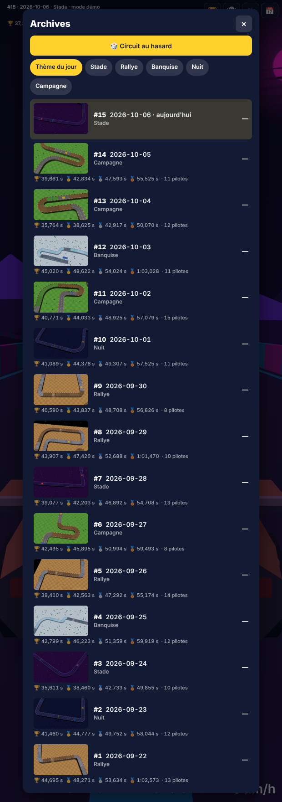
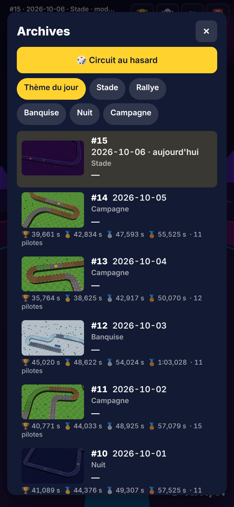

# Lot 13 — Miniatures des circuits dans les archives

**Essayer** : https://nathan-te.github.io/DailyTrack/b/lot-13-miniatures/?api=demo — puis touche **H** (ou le bouton 📅 Archives) et fais défiler : chaque jour montre une vue aérienne d'une portion marquante de son circuit.
**Ouvrir un jour** : https://nathan-te.github.io/DailyTrack/b/lot-13-miniatures/?api=demo&day=2026-09-30 — la même miniature s'affiche pendant le décompte.
**Essais** : `&thumbs=top` (vue d'aplomb) · `&thumbs=2d` (tracé 2D, sans WebGL) · `&thumbs=off` (aucune). Une fois fusionné, les mêmes liens marchent sur https://nathan-te.github.io/DailyTrack/ et le menu `/admin/` propose les trois options.

## Livré
- **`renderThumbnail(circuit, options)`** (`apps/web/src/thumbnail.ts`) : un canvas 16:9, **320 × 180** (×2 sur écran haute densité), d'une vue aérienne d'une portion du circuit, avec la palette, les revêtements, les blocs à effet, les portes et le **décor du thème** (le même que dans le jeu). `circuit` = `{ track, palette, theme }`, ce que donne `dailyCircuit` ; options `width`, `height`, `scale`, `view`, `webgl`, `timing`. **Un seul moteur de rendu** (`WebGLRenderer` partagé, canvas hors écran), créé à la première demande et **libéré 4 s après la dernière image** ; chaque scène jetable est libérée (`disposeScene`). Le panneau d'admin du lot 14 appellera cette fonction telle quelle.
- **Quelle portion** (`thumbFocus.ts`, logique pure, testée) : **8 blocs** (≈ 250 m) centrés sur le **passage signature** du thème (super turbo + virage relevé, tremplin sur terre, chicane sur glace, moteur coupé + point de contrôle, épingle sur terre) ; à défaut, la **zone la plus sinueuse** (le plus de virages, puis la plus ramassée). L'axe principal de la portion devient l'horizontale de l'image (départ → arrivée de gauche à droite : le 16:9 est fait pour ça) ; la caméra recule par bissection jusqu'à ce que tout tienne dans 92 % de l'image, puis recentre.
- **Caméra : aérienne inclinée à 58°** (champ 32°). J'ai comparé sur captures **d'aplomb** et **inclinée** (`?thumbs=top`) : l'inclinée garde les reliefs et les flancs de route, les tribunes, arbres et pylônes se lisent comme des objets, et la miniature ressemble au jeu ; l'aplomb est plus « carte » et ne coûte rien de plus. **Choix : inclinée** (une ligne : `TILT_DEG`). Les thèmes de nuit sont éclaircis pour la miniature seulement (ils étaient illisibles en petit ; le jeu garde sa nuit).
- **À la demande** : chaque ligne des archives a une case 16:9 de taille fixe (la liste ne bouge pas quand l'image arrive) ; elle est remplie quand la ligne **apparaît à l'écran** (`IntersectionObserver` sur le panneau qui défile, 120 px d'avance). **Une image à la fois**, au repos du navigateur (`requestIdleCallback`), les lignes sorties de l'écran sont sautées, la file est abandonnée à la fermeture du panneau.
- **Jamais pendant une course** : le service ne génère ni ne dessine que si `phase !== "racing"` ou si le jeu est **gelé**. **Les archives ouvertes gèlent désormais le jeu dans tous les modes** (avant : seulement au toucher ; au clavier la course continuait derrière le panneau, et rien n'aurait jamais été dessiné avant l'arrivée). Le chrono compte des pas de simulation : geler est exact, rien ne change pour les temps ni pour les rediffusions. Compteur de contrôle `ranWhileBlocked` (doit rester 0, vérifié par un test de navigateur).
- **Génération hors du fil principal** : un circuit coûte ≈ 200 ms à générer (pilote automatique) ; 15 d'affilée gèleraient l'écran. `circuitWorker.ts` (fil de travail, une demande à la fois) appelle le même `dailyCircuit` ; sans `Worker`, repli sur le fil principal, une tâche à la fois. Le circuit ouvert dans le jeu n'est jamais regénéré.
- **Cache** : mémoire (adresses `blob:`), puis **IndexedDB** (`cdj-thumbs`, 160 images au plus, les plus anciennes partent d'abord, toujours sous try/catch) ; **clé = id du circuit** (`jour-AAAA-MM-JJ-g<G>`, plus le thème s'il est forcé, plus la variante au lot 14) + `SIM_VERSION` + `THUMB_VERSION` + densité de pixels. Changer le générateur ou la physique change la clé : les anciennes images ne servent plus. `THUMB_VERSION` est à incrémenter quand on change l'aspect (cadrage, couleurs). Images en WebP (PNG si le navigateur ne sait pas l'écrire).
- **Repli sans WebGL** (ou contexte perdu) : **tracé 2D** du circuit, dans le même cadrage, aux couleurs du thème (route, rebords, revêtements, plaques, turbo, moteur coupé, tremplin, portes). `?thumbs=2d` le force.
- **Archives** : chaque ligne montre la miniature, le numéro, la date, le thème, les médailles, ta médaille et ta place figée. Le panneau garde son défilement quand les détails arrivent et ne clignote pas (les images déjà prêtes sont reprises de la mémoire).
- **À l'ouverture d'un jour** (archive, `?day=`, circuit au hasard) : la même miniature s'affiche en carte (`#daycard`) **pendant le décompte seulement** ; elle disparaît au départ.
- **Sans toucher à `sim`** : golden inchangés, `SIM_VERSION` et `GENERATOR_VERSION` inchangés. `buildTrackScene` reçoit seulement des options (`aerial`, `near`) : le jeu normal produit la même scène qu'avant.
- **Admin** : option « Miniatures des archives » (3D inclinée, d'aplomb, 2D, aucune) dans `/admin/`, comme l'exige la règle « tout nouveau paramètre d'adresse = une option ».

## Mesures
Rendu **logiciel** (SwiftShader, conteneur : la CI est dans le même cas) : une vraie carte graphique dessine une scène de cette taille en quelques millisecondes ; ces chiffres sont donc un **pire cas** pour le rendu, et une bonne mesure pour la part JavaScript. Profil téléphone (390 × 844, ×2, jeu en pas à pas pour ne mesurer que les miniatures), 15 miniatures de démonstration, une ligne à la fois :

| | Rendu 3D, CPU ×1 | Rendu 3D, CPU ×4 | Tracé 2D, CPU ×1 | Tracé 2D, CPU ×4 |
|---|---|---|---|---|
| Génération du circuit (fil de travail, moy. / max) | 104 / 217 ms | 126 / 318 ms | 105 / 336 ms | 121 / 407 ms |
| Construction + rendu (fil principal, moy. / max) | 316 / 979 ms | 597 / 1817 ms | 2 / 4 ms | 9 / 36 ms |
| Encodage WebP (asynchrone, durée réelle) | 163 ms | 185 ms | 100 ms | 106 ms |
| Poids moyen d'une image | 20 ko | 20 ko | 7 ko | 7 ko |
| Tâche la plus longue du fil principal | 1149 ms | 2017 ms | 557 ms | 446 ms |
| Les 15 images (défilement compris) | 9,8 s | 16,3 s | 4,5 s | 6,1 s |
| Mémoire JavaScript ajoutée | 2,3 Mo | 0,4 Mo | 0,5 Mo | ≈ 0 |

- **La part qui gelait, la génération, est sortie du fil principal** (le test de navigateur vérifie `mainThreadGenerations === 0`). Sur le fil principal elle aurait coûté ≈ 200 ms par circuit, ≈ 800 ms à ×4, soit des secondes de blocage pour 15 lignes. Reste, en 3D logiciel, le dessin lui-même : 0,3 à 1 s par image dans ce conteneur (une image à la fois, entre deux images du jeu ; **gelé** pendant les archives, donc sans conséquence pour une course). La 2D montre ce qui reste sur une machine où le dessin est rapide : ≈ 10 ms, et une première tâche plus longue (≈ 0,4 à 0,5 s : premier encodage WebP et mise en route).
- **Construire la scène** d'une miniature : 30 à 160 ms avant, **22 à 41 ms** après la restriction du décor à la portion montrée (`Builder.mute` : mêmes tirages au sort, aucune forme hors cadre, donc le même décor que le jeu).
- **Mémoire graphique** : un seul moteur (≈ 640 × 360 avec anti-crénelage), libéré 4 s après la dernière image ; ce que le jeu garde ensuite, ce sont des images de ≈ 20 ko (≈ 300 ko pour les 15).
- **Poids du jeu** : +5 ko compressés dans le code du jeu, et **+10 ko pour le fil de travail**, qui ne se charge qu'à l'ouverture des archives (c'est une copie de `sim` : générateur, pilote, physique). Le budget de `perf.spec.ts` est séparé en conséquence : chargement initial < 188 ko (≈ 183 ko aujourd'hui, 177 avant), hors three.js < 56 ko (52 avant : 47), fil de travail < 14 ko (10).
- **Circuit ouvert** : la miniature de la carte du décompte coûte un rendu (≈ 0,1 à 0,3 s en logiciel), ou une lecture du cache ; jamais une génération.

## Tests
- Vitest `test/thumbFocus.test.ts` (17) : passage signature des cinq thèmes (et leur absence), portion centrée de 8 blocs, repli sur la zone sinueuse, circuit plus court que la portion, orientation de l'axe, marge ; **les 7 circuits de référence du générateur** ont tous leur passage signature trouvé.
- Vitest `test/thumbnails.test.ts` (17) : clé de cache, mémoire / IndexedDB (autre séance sans rendu) / cache en panne, dédoublonnage, **une image à la fois et dans l'ordre**, **rien tant qu'une course tourne** (reprise quand elle finit, même si elle démarre pendant la génération), lignes sorties de l'écran sautées, file abandonnée, image en attente d'une course abandonnée dès que plus personne ne la veut, circuit de secours ou rendu en échec, générateur sans fil de travail (même circuit que le jeu). `test/admin.test.ts` : l'option `thumbs`.
- e2e `thumbnails.spec.ts` (11, Chromium) : en `?api=demo`, **les 15 miniatures apparaissent au défilement et leur contenu est vérifié sur les pixels** (taille, au moins 10 couleurs, pas d'image unie, **15 images toutes différentes**) ; cache (à la visite suivante : relues d'IndexedDB, pas refabriquées) ; archives ouvertes = course gelée, fermées = plus aucun travail, `ranWhileBlocked = 0` ; repli 2D ; carte d'un jour ouvert (contenu vérifié, disparaît au départ) ; vues inclinée et d'aplomb différentes ; ouverture des archives à ×4 sans génération sur le fil principal ; **trois formats de téléphone** sans débordement ni chevauchement. `perf.spec.ts` : budget de poids séparé.
- Suite complète : `npm run typecheck`, `npm test` (330 + ce lot) et `npm run test:e2e` (Chromium) verts ; golden inchangés.

## Limites / à décider
- **Lot 12 pas encore livré** : le seed le place avant celui-ci (largeurs de piste variables). Ce lot a été lancé à la demande de Nathan avant lui, et **les lots 10b et 12 restent à faire** (voir `docs/orchestration.md`). Quand les routes auront plusieurs largeurs : reprendre `FOCUS_MARGIN` (`thumbFocus.ts`) et la largeur de route du repli 2D (`thumbnail.ts`, `HALF_ROAD`), regarder les captures, et incrémenter `THUMB_VERSION` si le cadrage bouge. Les clés de cache suivent déjà `GENERATOR_VERSION`, donc les circuits régénérés auront de nouvelles miniatures sans rien faire.
- **Non vérifié sur un vrai téléphone** : fluidité du défilement, temps réel d'un rendu sur GPU mobile, comportement d'IndexedDB en navigation privée de Safari (le code tombe sur « pas de cache » sans erreur, vérifié seulement par un test où le cache lève une exception).
- **Choix de Nathan** : cadrage (8 blocs ; 6 serait plus serré, 10 plus lisible en « parcours »), inclinaison (58° ; `?thumbs=top` pour comparer), éclaircissement des thèmes de nuit, carte du décompte seulement pendant les 3 secondes (la garder dans l'écran de pause ou d'arrivée est possible).
- **Pour plus tard** : image d'aperçu pour les liens partagés (Open Graph) — la même fonction peut la produire, mais elle demande un rendu **côté serveur** ou une image fabriquée au moment du partage ; à proposer avec la mise en ligne. Une version de la miniature avec le passage signature entouré, ou des miniatures du planning (lot 14) en cache partagé avec les archives.
