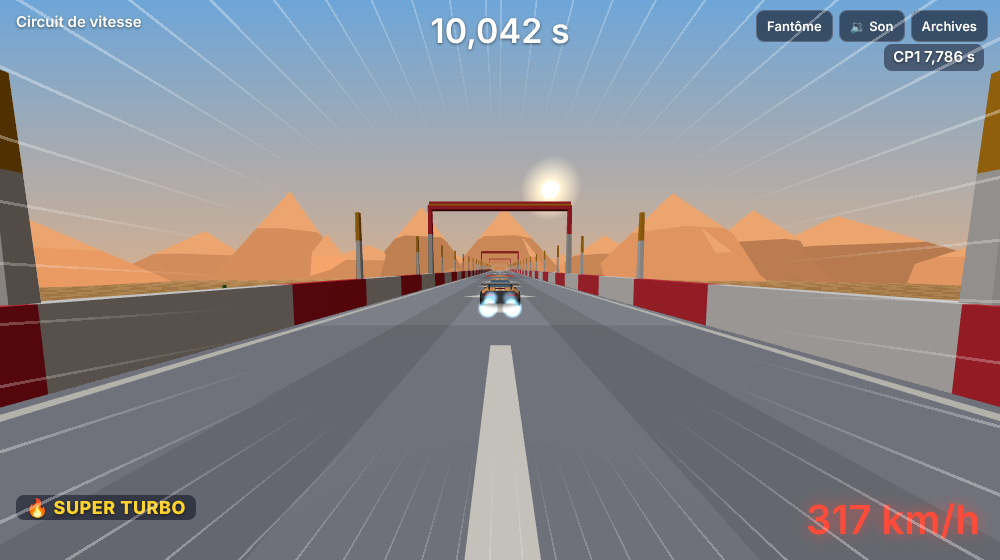
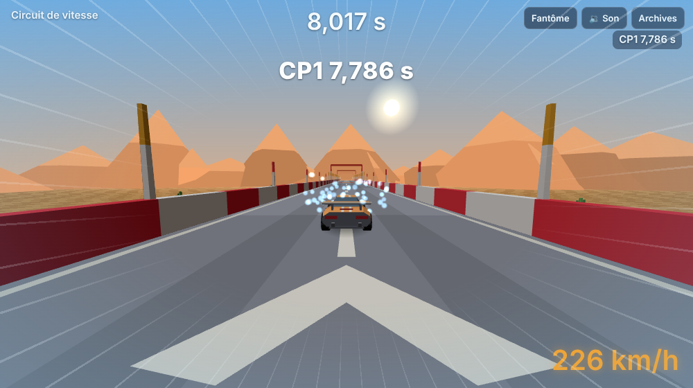

# Lot 15 — Vitesse : portions rapides et sensation de vitesse

**Essayer** : https://nathan-te.github.io/DailyTrack/b/lot-15-vitesse/?scenario=vitesse — départ, plaque en haut d'une longue descente (six blocs), deux super turbos enchaînés (jusqu'à 88 m/s, ≈ 317 km/h), grande courbe relevée (`R3/b`) prise à fond, puis freinage appuyé avant un virage serré. Mode démo pour regarder le pilote : ajouter `&demo`.
**Puis trois circuits du jour** (même base, `?seed=` ; touche **C** : caméra proche / loin) :
- Stade, **quatre super turbos** (deux paires enchaînées), 88 m/s, 30 % du temps au-delà de la pointe : https://nathan-te.github.io/DailyTrack/b/lot-15-vitesse/?seed=2026-10-14
- Banquise, **plaque en haut d'une descente** (66 m/s) : https://nathan-te.github.io/DailyTrack/b/lot-15-vitesse/?seed=2026-10-09
- Rallye, **turbos puis grande courbe relevée** : https://nathan-te.github.io/DailyTrack/b/lot-15-vitesse/?seed=2026-10-23

(Si l'environnement impose un autre nom de branche, remplacer `lot-15-vitesse` dans le lien ; une fois fusionné, les mêmes adresses marchent sur https://nathan-te.github.io/DailyTrack/ et le menu `/admin/` propose « Vitesse ».)

## Livré
- **La pointe n'est plus un plafond dur** (`car.ts`) : sur le plat la pointe reste **48 m/s** à pleins gaz (rien ne change en dessous), mais au-delà, une **traînée en cube** `overspeedDrag × ((u ÷ pointe)³ − 1)` remplace l'ancienne décélération constante de 14 m/s², qui coupait net la plaque. Les poussées vont donc plus haut : **plaque** jusqu'à `boostMaxSpeed` **66 m/s** (+37 %, était 58), **super turbo** jusqu'à `turboMaxSpeed` **88 m/s** (≈ 317 km/h, était 68), puis la voiture retombe progressivement (un turbo de 1,5 s depuis la pointe : 88 → 82 → 74 → 68 → 64 → 61 m/s, une seconde chaque fois ; près de la pointe après une douzaine de secondes). `overspeedDrag` vaut **2,5** (était 14, sa forme change).
- **Descentes** : `slopeGravity` passe de 10 à **40** (pente de 0,125 par bloc de descente : 5 m/s² au lieu de 1,25). Une longue descente tient la voiture au-dessus de la pointe (en entrant à 48 m/s : ≈ 60 m/s après six blocs, ≈ 65 après douze) ; une côte d'un bloc coûte ≈ 6 % de la vitesse (48 → 45 m/s).
- **Virages** : rien dans le modèle de pneus n'a changé ; la limite d'adhérence (≈ 40 m/s²) reste celle de tout virage : un virage ample `R3` (rayon 80 m) se prend à ≈ 60 m/s (un peu plus s'il est relevé), un large (48 m) à ≈ 43 m/s, un serré (16 m) à ≈ 26 m/s. Le pilote le sait déjà (vitesse de passage par courbure) et freine plus tôt à 88 m/s.
- **Garde-fou anti-traversée** : aucun changement de pas ni de collision n'a été nécessaire (le pas de collision, 0,375 m à 88 m/s, reste bien en deçà du rayon de disque de 1 m ; les rebords poussent par pénétration à chaque sous-pas). **Prouvé par test** (`packages/sim/test/vitesse.test.ts`, 4 cas à 88 m/s) : un rebord droit pris de biais de 5° à 60°, de face dans le rebord extérieur d'un virage serré, large, ample relevé, braquage à fond d'un côté puis de l'autre, et une transition de largeur suivie d'un virage serré : à chaque pas la voiture reste sur la route (ni vide, ni sous le sol).
- **Générateur** (`generator.ts`) : un à deux créneaux calmes de **portion rapide** par circuit, tirés parmi `chain` (deux super turbos à trois blocs d'écart : le second prolonge le premier), `drop` (plaque, six blocs de descente, deux droites) et `bank` (super turbo, cinq droites, puis grande courbe relevée `L3/b` ou `R3/b`, ou `L2/b` à défaut) ; ils gardent les droites obligatoires derrière eux (`TURBO_RUNOUT`, `PAD_RUNOUT`), n'occupent ni le créneau du tremplin ni celui de la signature. Les circuits **s'allongent en cellules** (≈ 38 blocs au lieu de ≈ 34) tout en restant dans 30–40 s ; le nombre de créneaux passe de 5–7 à **4–6** (sinon la durée moyenne montait à 38 s et le taux de validation chutait). Un circuit dont le pilote ne dépasse pas **`FAST_PEAK`** (30 % de la pointe : 62,4 m/s) est refusé, graine voisine. **`PilotRun`** donne maintenant `maxSpeed` et `fastTicks`.
- **Pilote** : inchangé (la trajectoire de course et le profil de vitesse suffisaient : gaz tant qu'il n'a pas atteint la vitesse de passage du point visé, freinage anticipé) ; il finit le scénario `vitesse` et 100 % des circuits sans reprise.
- **Sensation de vitesse** (`apps/web`, rien dans `sim`) :
  - **bord de piste** (`trackMesh.ts`, `speedFeel.ts`) : poteaux tous les 16 m sur le chapeau des rebords, **tous les 8 m dans une portion rapide** (`fastZones` : un super turbo et les 6 blocs suivants, une plaque suivie d'une descente, toute descente d'au moins 3 blocs) ; dans ces portions, **arches** (un bloc sur deux, hautes de 7 m) et **chevrons blancs peints** au centre de la route tous les 8 m ;
  - **caméra** (`main.ts`) : au-delà de la pointe, champ de vision **+10° au plus**, caméra **0,35 m plus basse**, **1,6 m plus loin** et un suivi plus lent (4/s de moins) ; le coup de zoom des plaques et turbos est réduit d'autant (7° / 4°, était 12° / 7°) pour que le total n'excède pas ce qu'il était ; **vibration** de 5 cm au plus à partir de la moitié de l'écart pointe → turbo (aucune secousse permanente, coupée par `?shake=0` et à la qualité basse) ;
  - **lignes de vitesse** : opacité 0,34 à la pointe, jusqu'à 0,6 à 88 m/s (était 0,38 au plus) ; **vent** : le volume continue de monter jusqu'à 1,9 × la pointe (était plafonné à 1,5) ;
  - **compteur** : jaune au-delà de la pointe, orange nettement au-delà, **rouge** à la vitesse d'un super turbo (`#speed[data-level]`) ;
  - **qualité** : poteaux, arches et chevrons sont du décor « lourd » (masqués à la qualité basse, absents des miniatures), la vibration est coupée à la qualité basse ; rien ne crée d'objet à chaque image.
- **Scénario** `?scenario=vitesse` (`VITESSE_TRACK_SPEC`, 42 blocs, 25,5 s au pilote, 88 m/s, 54 % du temps au-delà de la pointe) et raccourci de `/admin/`. Panneau `?debug&tune` : sliders pour `overspeedDrag`, `boostMaxSpeed`, `turboMaxSpeed`, `slopeGravity`.
- **Script de mesure** : vitesse maximale du pilote, part du temps au-delà de la pointe, colonne « portion rapide » et « vitesse max » dans le tableau par thème.
- **Versions** : `SIM_VERSION` **6**, `GENERATOR_VERSION` **6** ; golden (`essai-autopilot.json`, `daily-golden.json`) régénérés ; `npm run history:seed` relancé (nouveaux circuits, nouvelles courses des pilotes fictifs).
- **Ménage** (`docs/orchestration.md`) : PR de la retouche 10b (#23), « route de 14 m » → 14 / 20 / 26 m, mention du téléphone.

## Mesures (`npm run measure:generator`, 60 dates depuis le 06/10/2026)
| | Avant (v5) | Après (v6) |
|---|---|---|
| Temps d'auteur min / moyen / max | 30,5 / 35,2 / 39,7 s | **30,1 / 34,6 / 40,0 s** (60/60 dans [30 ; 40] s) |
| Blocs par circuit | 33,9 | **37,8** |
| Vitesse max du pilote (min / moyenne / max) | ≤ 48 m/s | **63,7 / 83,3 / 88,3 m/s** ; ≥ +30 % : **60/60** |
| Part du temps au-delà de la pointe (moyenne / min / max) | 0 % | **24 % / 9 % / 46 %** |
| Deux largeurs ou plus ; virages serrés | 60/60 ; max 2, jamais deux d'affilée | 60/60 ; max 2, jamais deux d'affilée |
| Circuits de secours ; tentative retenue (moyenne / max) | 0 ; 1,2 / 5 | 0 ; 1,1 / 5 |
| Génération (moyenne / max) | 72 / 216 ms | 67 / 180 ms |
| **Rejeu d'une course d'auteur** (moyenne / max) | **21,5 / 31,4 ms** | **21,3 / 30,6 ms** (aucun surcoût : même nombre de pas) |
| Bronze (×1,40) au-dessus de 45 s | 51/60 | 45/60 |

**Taux de validation par thème** (12 dates × 6 tentatives, thème forcé ; « fenêtre » = construit ET durée dans [30 ; 40] s, « portion rapide » = fenêtre ET pilote ≥ 62,4 m/s) :
| Thème | Fenêtre avant | Fenêtre après | Portion rapide après | Durée moyenne après | Vitesse max moyenne |
|---|---|---|---|---|---|
| Stade | 70 % | 55 % | 55 % | 33,3 s | 88 m/s |
| Rallye | 73 % | 57 % | 57 % | 33,1 s | 83 m/s |
| Banquise | 56 % | 58 % | 58 % | 37,5 s | 81 m/s |
| Nuit | 53 % | 60 % | 60 % | 34,2 s | 86 m/s |
| Campagne | 74 % | 54 % | 52 % | 31,2 s | 82 m/s |

« Pilote finit » : 98–100 % partout (Rallye 98 % : une tentative sur une cinquantaine). Le taux dans la fenêtre baisse pour Stade, Rallye et Campagne (de 15 à 20 points : ≈ 70 → ≈ 55 %) : ce sont des tentatives écartées par la durée (trop courtes ou trop longues), jamais par un échec du pilote ; la génération reste rapide (1,1 tentative en moyenne, 5 au pire sur 40 permises). Essais de réglage : avec 5 à 7 créneaux, la durée moyenne montait à 38 s et la fenêtre tombait à 35–57 % (Banquise 35 %, tentative retenue 1,7 en moyenne et jusqu'à 11) ; avec 4 à 7, 34–50 % ; avec **4 à 6**, le meilleur compromis.

## Tests (seuils recopiés de `packages/sim/test/vitesse.test.ts` et `generator.test.ts` ; s'ils changent, la sensation a changé)
- Sur le plat, la pointe reste 48 m/s (jamais au-dessus, ≥ 99 % atteints).
- En descente (douze blocs) : pic > 54 m/s (pointe + 6) et < 88.
- Après un super turbo : pic > 72 m/s (1,5 × la pointe) et ≤ 88,5 ; **décroissance stricte** seconde après seconde pendant 8 s ; au plus 12 m/s perdus la première seconde ; 3 s après le pic encore > 60 m/s (1,25 × la pointe) ; 12 s après < 55,2 m/s (1,15 ×).
- Plaque : > 63 m/s ; deux turbos enchaînés > 85 m/s.
- Aucune traversée à 88 m/s (4 cas, voir plus haut).
- **60 dates consécutives** : le pilote (`bestPilotRun`) dépasse 62,4 m/s sur chacune, et son temps est le temps de l'auteur ; chaque circuit a un `T` ou un `P` ; une plaque est suivie de deux blocs sans virage.
- Le pilote finit `?scenario=vitesse` sans reprise, à plus de 80 m/s, avec plus du tiers du temps au-delà de la pointe.
- `apps/web/test/speed.test.ts` : fonctions pures de la sensation de vitesse ; e2e `vitesse.spec.ts` : le navigateur rejoue le pilote au temps de Node, le compteur passe au niveau rouge (> 250 km/h), les lignes de vitesse dépassent 0,45 et le champ de vision 80°.

## Limites et décisions pour Nathan
- **Les « descentes » rapides sont modestes** : à 0,125 de pente par bloc de descente, six blocs mènent à ≈ 60 m/s. Les 80–90 m/s viennent des super turbos ; les descentes plus marquées (plus raides, plusieurs niveaux) sont le **lot 17** (relief). J'ai monté `slopeGravity` à 40 pour qu'une descente se sente (5 m/s², contre 1,25), au prix d'une côte plus sensible : à toi de juger sur `?scenario=vitesse` et dans le panneau `?debug&tune`.
- **Une plaque donne 66 m/s** (+37 %) : c'est elle qui fait passer la barre des 30 % sur les circuits sans super turbo ; 12 circuits sur 60 n'ont aucun super turbo : la plaque (66 m/s) suffit alors à passer la barre.
- **Lot 12 retouché** : le test « la largeur dominante dépend du thème » exigeait un écart de 3 m entre Stade et Rallye ; il est de 2,5 m depuis qu'un créneau a été retiré (moins de changements de largeur) ; le seuil du test passe à 2 m. Le principe (Stade et Banquise plus larges, Rallye et Campagne plus étroits) tient.
- **Taux de validation** : Stade, Rallye et Campagne baissent de 15 à 20 points dans la fenêtre (voir tableau), Banquise et Nuit montent ; aucune dégradation du pilote ni circuit de secours.
- **Bronze** : 45 circuits sur 60 ont un bronze (×1,40) au-delà de 45 s (51 avant). Facteurs candidats (non appliqués) : ×1,30 → 52 % des circuits sous 45 s, ×1,25 → 67 %, ×1,20 → 78 %.
- **Non vérifié** : le ressenti sur un vrai téléphone (rendu, fluidité des poteaux et arches, vibration) ; le vertige à très grand champ de vision (105° au plus en caméra proche, 108° avant : les 10° d'ouverture à haute vitesse remplacent une partie de l'ancien coup de zoom et de l'ancien plafond à 1,4 × la pointe) ; le rendu sur Firefox et WebKit (la CI les lance).
