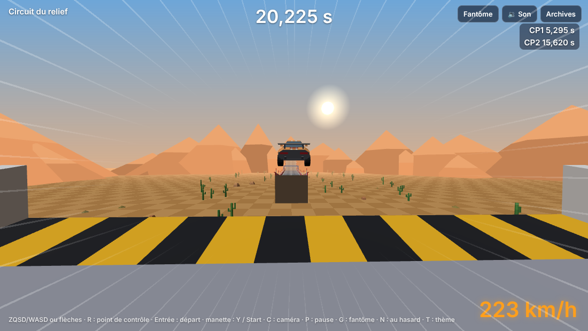
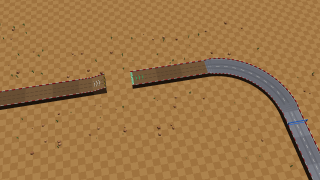

# Lot 17 — Relief et vrais sauts

**Essayer** : https://nathan-te.github.io/DailyTrack/b/lot-17-relief/?scenario=relief — montée de deux niveaux, crête, longue descente ; un saut court ; une plaque puis un long saut avec changement de niveau ; une montée de six niveaux et une section surélevée **sans rebords** à 24 m au-dessus du point le plus bas.

Trois circuits du jour choisis pour leur relief :
- **Stade** (long saut après un super turbo, descente raide, 24 m de dénivelé) : https://nathan-te.github.io/DailyTrack/b/lot-17-relief/?seed=2026-10-22
- **Rallye** (deux sauts sur la terre, une section sans rebords, 24 m) : https://nathan-te.github.io/DailyTrack/b/lot-17-relief/?seed=2026-10-15
- **Nuit** (cinq blocs sans rebords en hauteur, un saut, 28 m) : https://nathan-te.github.io/DailyTrack/b/lot-17-relief/?seed=2026-11-22

(Si l'environnement impose un autre nom de branche, remplacer `lot-17-relief` dans le lien ; une fois fusionné, les mêmes adresses marchent sur https://nathan-te.github.io/DailyTrack/ et le menu `/admin/` propose « Relief et sauts ».)

## Livré

**Relief** (`packages/sim/src/track.ts`)
- `LEVEL` = 4 m. `U` / `D` : un niveau sur une cellule (pente 0,125, comme avant) ; **`U2` `U3` `D2` `D3`** : deux et trois niveaux sur une cellule (pentes 0,25 et 0,375). Les hauteurs s'enchaînent comme avant (`Block.rise` = dénivelé résolu du bloc).
- Un **dos d'âne** (`U2 D2`) fait décoller à haute vitesse (crête) ; une descente raide nourrit les portions rapides du lot 15 (la portion `drop` du générateur en utilise).
- Les routes **surélevées** reposent sur des piliers (rendu) ; le vide dessous est visible.

**Sauts** (`K`, `G`, `jump.ts`)
- **`K`** : rampe de saut (plate jusqu'à 16 m, puis un niveau de plus en pente 0,25) ; **`G`** : un vide de 32 m (aucun sol, aucun rebord) ; **`GU` `GD` `GD2`** : le bord d'en face est 1 niveau plus haut, 1 niveau plus bas, 2 niveaux plus bas. La réception est un bloc ordinaire (`D`, `S`…). Le tremplin `J` du lot 2 reste (circuit d'essai, `pilotage`).
- **Fenêtre de vitesse** : `trackJumps(circuit)` donne, pour chaque saut, la vitesse **au bord de la rampe** en dessous de laquelle on tombe (`minSpeed`) et celle au-delà de laquelle on retomberait après la ligne droite de réception (`maxSpeed`). Formule balistique (pente de la rampe, gravité, hauteur du bord d'en face, tolérance de 0,6 m de la suspension) avec une marge de 5 % mesurée ; **vérifiée contre la vraie simulation** par bissection (`test/sauts.test.ts`) : l'écart est de +1 % à +3 %.

| Saut | Notation | Plancher au bord de la rampe |
|---|---|---|
| court (un niveau plus bas) | `K GD` | 33 m/s (119 km/h) |
| plat (réception en descente) | `K G D` | 40 m/s (144 km/h) — la pointe du plat est 48 m/s et la rampe en coûte 3 : il part d'une **plaque** |
| long bas | `K G GD D` | 52 m/s — plaque (66 m/s) |
| long | `K G G D` | 58 m/s — **super turbo** (88 m/s) |
| haut (un niveau plus haut) | `K GU` | 55 m/s — super turbo |

- **Réception** : la vitesse se garde (aucune perte mesurée à plat ou en descente, `après ≥ 93 %` du bord de la rampe dans le test) ; une réception de travers en coûte comme avant (`land`, lot 7).
- **Sans rebords** : modificateur `o` (`S/o`). La voiture peut quitter la route par le côté, et tombe. Le générateur n'en met que sur des parties surélevées (≥ 6 m au-dessus du point le plus bas), selon le thème.

**Chute et reprise automatique** (`race.ts`)
- Sous `track.voidY` (route la plus basse − 4 m), `race.fallTicks` démarre ; la voiture continue de tomber **sans commande** pendant `FALL_TICKS` = 60 pas (0,5 s, ≈ 1 s depuis qu'elle a quitté la route), puis reprend au **dernier point de contrôle**, avec la vitesse du passage. Le chrono ne s'arrête jamais. La touche de reprise pendant la chute reprend tout de suite. Identique au rejeu (test Vitest, et le navigateur retombe au même pas que Node).
- Web : voile sombre qui monte, bandeau « Chute ! », deux sons (sifflement descendant, petite montée à la reprise), caméra qui ne plonge pas avec la voiture, vibration sur téléphone.
- **Ombre d'atterrissage** (`landing.ts`) : en l'air au-dessus d'un vide, l'ombre se pose là où la trajectoire retrouve le sol (lecture seule du monde) ; si elle ne retombe sur rien, il n'y a pas d'ombre : c'est la chute.

**Générateur** (`generator.ts`, `themes.ts`)
- **Dénivelé minimal** `MIN_RELIEF` = 12 m par circuit (du point le plus bas au plus haut de la route) : le premier relief d'un circuit en fait au moins 12. Reliefs doux (`U U S D D`, creux…) ou raides (`U3 S D3`, dos d'âne, plateau surélevé…), hauteurs gardées entre −24 et +24 m.
- **Vrai saut** (5 types, voir le tableau) : `jumpChance` par thème — Stade 100 %, Nuit 100 %, Rallye 40 % en plus de sa signature (qui devient **un saut court sur la terre**), Banquise 35 %, Campagne 40 %. Chaque saut est précédé de ligne droite ou d'une plaque / d'un super turbo et suivi de 3 à 5 lignes droites. Créneaux par priorité : signature, saut, virages marquants, portions rapides, reliefs.
- **Sections sans rebords** : `openChance` — Stade 0, Rallye 40, Banquise 0, Nuit 70, Campagne 50 %.
- **Pilote** : le freinage tient compte de la pente ; aucun freinage en l'air (la vitesse visée ne baisse pas de la rampe à la fin de la réception) ; il reste au milieu sur rampe, vide et réception ; **il est refusé s'il aborde un saut hors de sa fenêtre** (vitesse au bord ≥ 1,08 × le plancher et ≤ plafond). Les montées raides ne se posent que sur la route (sur l'herbe, la voiture cale : mesuré).
- **Pas de pont à deux niveaux** : la grille réserve une cellule par bloc ; un croisement demande des blocs superposés. Non fait (pas simple), à dire à Nathan.
- **Versions** : `SIM_VERSION` 8, `GENERATOR_VERSION` 8 ; golden, `history:seed` et `measure:generator` relancés. Les blocs existants rejouent **au bit près** : la rediffusion de référence du circuit d'essai n'a changé que de numéro de version.

## Mesures (`npm run measure:generator`, 60 dates à partir du 06/10/2026)

| | moyenne | min | max |
|---|---|---|---|
| temps d'auteur | 35,6 s (34,5 avant) | 30,1 s | 39,9 s |
| dénivelé | 17,9 m | 12 m | 36 m |
| blocs par circuit | 40,9 (38,0 avant) | | |

- Dans la fenêtre 30–40 s : 60/60 ; circuits de secours : 0 ; tentative retenue : moyenne 2,0, max 12.
- Dénivelé ≥ 12 m : 60/60 ; pentes : 6,7 blocs par circuit dont 1,6 raides ; dos d'âne : 9 circuits.
- Vrai saut : Stade 15/15, Rallye 13/13, Nuit 14/14, Banquise 6/14, Campagne 3/4. Types : 32 m bord −4 m × 26, 32 m même niveau × 14, 64 m × 7, bord +4 m × 6, 64 m bord −4 m × 2.
- Vitesse du pilote au bord de la rampe : au moins 1,14 × le plancher (exigé 1,08), moyenne 1,40. Sections sans rebords : 17/60 circuits (Rallye 8/13, Nuit 8/14, Campagne 1/4). Chutes du pilote : 0.
- Génération : moyenne 163 ms, max 529 ms (107 / 322 avant).

**Coût d'un rejeu** (même machine, `main` mesuré en début de session) : **38,3 ms** en moyenne (max 53,5) contre **34,6 ms** (max 54,0) avant le lot, soit +11 % ; l'hébergement n'en est pas changé.

## Garde-fous

- `packages/sim/test/relief.test.ts` : notation (`U2`…`D3`, `K`, `G`, `GU`/`GD`/`GD2`, `o`), pentes, hauteurs chaînées, seuil de chute ; vide sans sol ni rebord ; section sans rebords ; **une chute** : tombe, délai exact `FALL_TICKS`, reprise au dernier point de contrôle, chrono qui continue, **identique au rejeu** (encodé puis décodé) ; scénario `relief`.
- `packages/sim/test/sauts.test.ts` : pour les 5 types de saut, le plancher prévu colle à la simulation (−3 % à +10 %), **franchi dans la fenêtre sans perte de vitesse, raté en dessous** (85 % et 60 % du plancher) ; sur 60 dates : dénivelé ≥ 12 m, le pilote franchit chaque saut avec marge, Stade / Nuit / Rallye ont toujours un vrai saut, Banquise et Campagne parfois, sections sans rebords surélevées.
- `apps/web/test/landing.test.ts` (ombre d'atterrissage), `thumbFocus`, `adminPlanning` (stats de relief), `admin` (préréglage) ; `apps/web/e2e/relief.spec.ts` : le pilote finit `?scenario=relief` au temps de Node ; un saut raté fait tomber la voiture, le voile monte, les sons jouent, et la reprise a lieu **au même pas et à la même position** que dans Node.
- `race.test.ts` : la chute ne ramène plus tout de suite (délai de 0,5 s).

## Choix à connaître

- Le plancher d'un saut se lit **au bord de la rampe** : la pente coûte ≈ 2 à 4 m/s et l'accélérateur en rend. Au même niveau, un vide de 32 m demande 40 m/s : c'est trop près de la pointe du plat pour un saut « libre », donc il part d'une plaque.
- **Les circuits sont un peu plus longs** (les sauts et les reliefs ajoutent des blocs) : durée d'auteur moyenne 35,6 s contre 34,5 s ; 40 à 50 % des tentatives tombent dans la fenêtre 30–40 s (55–60 % avant). Pas de souci de génération (moyenne 163 ms).
- Les tests de classement de l'API sont ancrés sur le **09/10/2026** (le 13/10 donnait des temps non monotones selon le niveau du pilote).
- Le jeu de démo (`history:seed`) : les pilotes fictifs mettent plein gaz avant une rampe (un pilote prudent ne passe aucun saut) ; 8 à 15 pilotes classés par jour comme avant.

## Pas encore fait / à voir avec Nathan

- Pont à deux niveaux (croisement) : non fait, voir plus haut.
- Le Rallye signe un **saut sur la terre** : la terre ralentit un peu ; le plancher du saut court (33 m/s) laisse de la marge.
- Une montée raide (`U2`, `U3`) reste toujours sur la route (sur l'herbe, la voiture cale) : à trancher si l'on veut du relief raide sur la terre.
- Vrai téléphone : l'ombre d'atterrissage et le voile de chute n'ont été vus que sur le rendu logiciel du conteneur.
