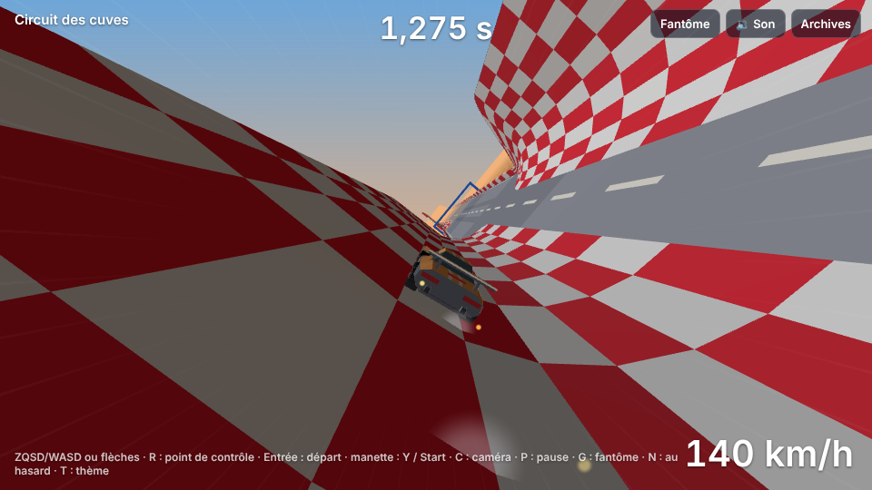
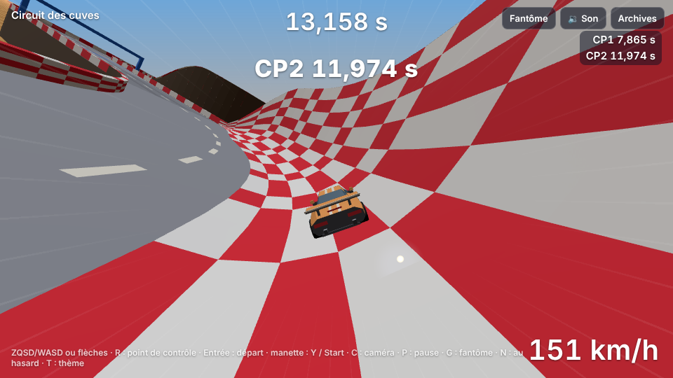
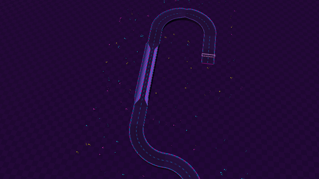
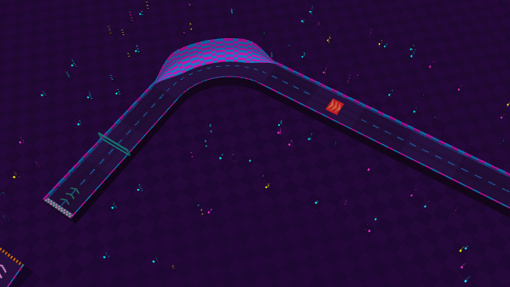

# Lot 18 — Cuves : rouler sur les murs

**Essayer** : https://nathan-te.github.io/DailyTrack/b/lot-18-cuves/?scenario=cuves — un élan, une **cuve droite** (demi-tube, quatre `V`), un **mur latéral** à gauche (quatre `ML`, à prendre vite : sous ≈ 24 m/s on glisse vers le fond), un **virage en cuve** large (`L2/c`) abordé à pleine vitesse ; puis un demi-tour serré (`R R`) qui ramène la vitesse bien plus bas, et **le même virage en cuve abordé trop lentement**.
**Puis deux circuits du jour avec une cuve** (même base, `?seed=` ; touche **T** pour le thème suivant, **N** pour une date au hasard) :
- Stade, **cuve droite** (4 blocs, 35,2 s d'auteur) : https://nathan-te.github.io/DailyTrack/b/lot-18-cuves/?seed=2026-10-13
- Nuit, **mur latéral** à droite (4 blocs, 33,3 s) : https://nathan-te.github.io/DailyTrack/b/lot-18-cuves/?seed=2026-10-28
- (en plus) Stade, **virage en cuve** large (36,4 s) : https://nathan-te.github.io/DailyTrack/b/lot-18-cuves/?seed=2026-10-14

(Si l'environnement impose un autre nom de branche, remplacer `lot-18-cuves` dans le lien ; une fois fusionné, les mêmes adresses marchent sur https://nathan-te.github.io/DailyTrack/ et le menu `/admin/` propose « Cuves et murs ».)

## Livré

**Blocs** (`packages/sim/src/track.ts`, `cuve.ts`)
- Une cuve est **une droite ou un virage avec un attribut** (`Block.cuve`, bits `CUVE_LEFT` | `CUVE_RIGHT`), pas un type de bloc de plus : revêtement, largeur et chaînage d'hauteurs continuent de marcher. Notation : **`V`** cuve droite (parois des deux côtés), **`ML`** / **`MR`** mur latéral à gauche / à droite, **`/c`** sur un virage (`L2/c`, `R3/c`, `L/c` : sa paroi est du côté extérieur).
- **Profil** (en travers de la route, demi-largeur `W` = 7 / 10 / 13 m) : fond plat, **quart de cercle** de rayon `0,65 × W` (4,6 / 6,5 / 8,5 m) qui devient **vertical** en `W`, puis une paroi verticale (jusqu'à `R + 8 m` à l'affichage ; **sans limite de hauteur pour la physique** dès que la paroi est à demi montée : une voiture lancée trop haut retombe dans la cuve au lieu de passer de l'autre côté). Largeur constante dans une cuve (pas de transition), plate (aucun relief), pas de repère ni de `o`/`b` : `parseToken` refuse.
- **Entrées et sorties progressives** : l'amplitude de la paroi monte de 0 (rebord ordinaire de 1,4 m) à 1 en rampe lisse, **16 m** sur une droite, **30 % de l'arc** dans un virage (7 / 22 / 37 m) ; **sauf** si le bloc voisin prolonge la même paroi (`cuveIn` / `cuveOut`) : une série de `V` est une seule cuve. Le virage est une **surface de révolution** (la distance se mesure au centre du virage).

**Physique** (`car.ts`, `substepShell`) — **contact par la normale** à la surface, sans surface paramétrée par bloc : la surface est décrite par une **distance signée** (`shellAt`, en travers de la route ; le bloc la lit en `(p, q)`), ce qui suffit pour une paroi jusqu'à 90° là où une hauteur de sol ne le pourrait pas.
- Dans un bloc de cuve, `stepCar` appelle `world.shell(x, z, y)` et, s'il répond, `substepShell` remplace le modèle à ressorts : la voiture est repérée dans le **plan tangent** (`tangentFrame` : avance, gauche, normale) ; `car.yaw` reste un cap « à plat » et la voiture tourne autour de la normale ; **mêmes pneus, moteur, frein et glace** qu'à plat (formules recopiées) ; la pesanteur se projette sur le plan ; la paroi **repousse** la position le long de la normale et **supprime** la vitesse qui y entre (sans rebond) ; en l'air, balistique ; une paroi qui s'éloigne de moins de 10 cm s'accroche (fin de rampe). `CarState` gagne `nx, ny, nz` (la normale sous la voiture, (0, 1, 0) hors cuve).
- **Décrochage** (cuve **droite**) : au-dessus de `shellStickHi` = **34 m/s** la pesanteur le long de la paroi est annulée (elle tient sur la verticale), sous `shellStickLo` = **24 m/s** elle s'applique en entier, entre les deux c'est progressif (`smoothstep`) ; **et seulement tant que la voiture ne monte ni ne descend franchement** (3 → 9 m/s de vitesse verticale : au-delà la pesanteur revient, sinon une voiture lancée vers la crête monterait sans fin) ; l'adhérence suit la charge presque en proportion sur une paroi, et `shellDown` = **1,2 g** d'appui charge les pneus à vitesse. Trois clés de `CarParams`, dans `?debug&tune`. **Dans un virage en cuve, la pesanteur reste entière** : la géométrie tient la voiture à sa hauteur d'équilibre (`tan θ = v² / (g × rayon)` : serré à 48 m/s ≈ 77°, large ≈ 60°).
- **Les blocs sans cuve rejouent au bit près** : un circuit sans cuve a un monde **sans `shell`** (aucun appel, aucun coût), et la rediffusion de référence du circuit d'essai n'a changé que de numéro de version (même temps, 32,883 s ; mêmes intermédiaires).

**Pilote** (`autopilot.ts`) : `AutopilotOptions.wall` (faux par défaut). `wall: true` = trajectoire **clouée à la paroi extérieure** du virage en cuve (écart latéral imposé, entonnoir de 40 m en lissage cubique avant et après, à 1 / 2 / 2,5 m du pied de la paroi verticale selon la taille du virage ; `racingLine` compte `g × pente de la paroi` comme un relevé ; aucun freinage sur la rampe de sortie). **`bestPilotRun` essaie les deux lignes** (fond et paroi, 4 niveaux d'adhérence chacune) et garde la plus rapide : `PilotRun.wall` dit laquelle. La relaxation de la trajectoire va plus loin (4000 itérations au lieu de 400) seulement pour un circuit qui a un virage en cuve : les autres gardent leur tracé.

**Générateur** (`generator.ts`, `themes.ts`) : `Theme.cuveChance` — **Stade 100 %, Nuit 100 %, Banquise 25 %**, Rallye et Campagne 0 % (rien n'est tiré pour un thème sans cuve). Trois motifs (poids 3 / 2 / 3) : **cuve droite** (`S V V V V S`), **mur latéral** (`S ML ML ML ML S`, côté tiré), **virage en cuve** (`L2/c`, `L3/c`, parfois le serré `L/c`, qui compte dans le budget de virages serrés). Priorité des créneaux : signature, saut, **cuve**, virages marquants, portions rapides. Une cuve droite ou un mur ajoute six cellules : un créneau de moins pour garder la durée ; s'il n'y a pas de créneau calme libre, c'est un virage en cuve. Un thème à 100 % refuse la tentative sans cuve (graine voisine).

**Rendu** (`trackMesh.ts`, `carPose.ts`, `telemetry.ts`, `fx.ts`, `main.ts`)
- Parois en **damier rouge et blanc** (bandes de 4 m dans le sens de la marche), chapeau de crête, remblai derrière chaque paroi ; fond à la couleur du revêtement.
- **Caméra** : son « haut » est entre la verticale et la normale de la voiture (60 % du roulis) : elle penche avec elle sans la coucher, la lisibilité reste. **Voiture et fantôme** : la normale (lissée à 12 /s) tourne le « haut » du monde, autour de l'avance de la route, donc le cap reste le long de la paroi.
- **Traces de pneus** posées sur la paroi (ruban orienté par la normale, roues arrière, dès 12 m/s) et **étincelles** des roues arrière sur la paroi (dès 18 m/s) ; roues posées dans le plan de la caisse ; ombre masquée sur une paroi.
- Admin : préréglage « Cuves et murs », ligne « Cuves » du planning ; miniature d'archive **cadrée sur la cuve** (elle passe avant le passage signature : Stade et Nuit en ont presque toujours une).
- `?scenario=cuves` (`CUVES_TRACK_SPEC`, 25 blocs, ≈ 21 s).
- **Versions** : `SIM_VERSION` **9**, `GENERATOR_VERSION` **9** ; golden, `history:seed` et `measure:generator` relancés.

## Seuils mesurés (`packages/sim/test/cuves.test.ts`)

Voiture posée sur la paroi verticale d'un mur latéral (`ML`, route de 20 m : `R` = 6,5 m), à 7,5 m de haut, en ligne droite :

| Vitesse | Quitte la paroi (< 45°) | Reste |
|---|---|---|
| 8 m/s | 0,77 s | arrêtée sur le bas du quart de cercle (≈ 18°) : un pneu tient une pente de 18° |
| 15 / 20 / 24 m/s | 0,77 / 0,77 / 0,79 s | revient au fond |
| 26 / 28 m/s | 0,99 / 1,63 s | revient au fond (glisse plus lentement) |
| 30 m/s | 2,27 s | revient sur le bas du quart de cercle |
| **32 m/s et plus** | **jamais** | **tient à 90°**, hauteur gardée sur toute la longueur de la série (192 m) |

- À bonne vitesse (42 m/s) la voiture garde **≥ 80°** sur toute la longueur d'un mur latéral, et **≥ 85°** sur la paroi verticale ; elle ne descend pas sous `R`.
- Trop lente (8 / 15 / 22 m/s) : elle **quitte la paroi en moins de 2 s** (0,77 s), sans la traverser (écart latéral ≤ `W`) ni passer sous le fond ; elle **repart** aux gaz après le décrochage.
- **Aucune traversée à 88 m/s** (30, 60 et 88 m/s, braquage à fond contre l'une puis l'autre paroi) : distance à la surface ≥ −0,05 m à chaque pas, jamais de l'autre côté dans la zone de paroi pleine.
- 40 graines de **commandes au hasard** sur un circuit de tous les blocs de cuve (60 s chacune) : état toujours fini, vitesse < 150 m/s, distance à la surface > −0,2 m, normale unitaire.
- **Un braquage franc contre la paroi à vitesse** (0,15 à 1,2 s à fond à 30 / 40 / 48 m/s) la fait monter jusqu'à 9–27 m au-dessus du fond (la paroi dessinée en fait 14,5) puis redescendre : elle reste dans la cuve (c'était le piège de ce lot : voir « Choix à connaître »).

## Mesures (`npm run measure:generator`, 60 dates à partir du 06/10/2026)

| | avant (v8) | après (v9) |
|---|---|---|
| temps d'auteur min / moyen / max | 30,1 / 35,6 / 39,9 s | **30,1 / 35,2 / 39,7 s** |
| dans [30 ; 40] s | 60/60 | **60/60** |
| circuits de secours | 0 | **0** |
| tentative retenue (moyenne / max) | 2,0 / 12 | 1,9 / 17 |
| génération (moyenne / max) | 79 / 245 ms | 97 / 616 ms |
| **rejeu d'une course d'auteur** (même machine, `main` mesuré en début de session) | **17,5 ms** (max 28,7) | **20,0 ms** (max 40,2) |

- **Cuves** : Stade 15/15, Nuit 14/14, Banquise 3/14, Rallye et Campagne 0 ; types : cuve droite × 13, mur latéral × 8, virage en cuve × 11.
- Taux de validation par thème (12 dates × 6 tentatives) : Stade 32 % construits (57 % avant), pilote finit 96 %, **dans la fenêtre 78 %** (41 % avant) ; Nuit 46 % (68 %), 97 %, **70 %** (51 %) ; Banquise 67 %, 90 %, 48 % ; Rallye et Campagne inchangés (45 / 48 %). Moins de circuits construits (la cuve réserve de la place sur la grille) mais plus de bons : la moyenne des tentatives ne bouge pas.
- **Coût d'un rejeu** : **+14 %** en moyenne sur les 60 dates (20,0 ms contre 17,5 : ce ne sont plus les mêmes circuits) ; sur les **mêmes** circuits (les jours Rallye et Campagne, dont le texte n'a pas changé), **+4 à 5 % par pas** (3,65 → 3,87 µs et 3,87 → 4,07 µs, deux mesures alternées avant / après sur 17 circuits) . Sur ce chemin, un circuit sans cuve ne diffère que par un test `world.shell !== undefined` par sous-pas, une comparaison de `car.ny` et trois champs de plus dans l'état de la voiture (aucun appel de `shell`) ; **je n'ai pas isolé la cause des 4–5 % ni des 14 %** : à surveiller. **Un pas dans une cuve coûte 1,1 µs contre 3,4 µs à plat** (pas de ressorts ni de rebords à tester) ; une course sur le scénario `cuves` se rejoue en 8,7 ms. L'hébergement n'en est pas changé (toujours au-dessus des 10 ms de l'offre gratuite de Cloudflare Workers : décision 1 de `docs/orchestration.md`).

## Garde-fous

- `packages/sim/test/cuves.test.ts` (26) : notation (`V` `ML` `MR` `/c`, refus de ce qui n'a pas de sens, prolongement d'une paroi par le voisin, largeur différente = rampe) ; géométrie (distance nulle sur le fond, le quart de cercle et la paroi, normale unitaire, surface continue, rampe, virage en cuve, hauteur de sol des effets) ; paroi (tient à 80° / 85°, décroche et repart, aucune traversée à 88 m/s, un monde sans cuve n'a pas de `shell` et rejoue au bit près, commandes au hasard) ; virages en cuve (le pilote finit chaque taille et chaque sens, sur le fond et sur la paroi ; sur la paroi la voiture monte vraiment et garde de la vitesse ; rediffusion encodée puis décodée identique ; scénario `cuves`) ; générateur (Stade et Nuit : une cuve par circuit, durée dans la fenêtre, aucun secours, les trois motifs, jamais sur le départ ni l'arrivée, sur la route, plate ; Rallye et Campagne n'en ont jamais ; temps d'auteur ≤ pilote sur le fond).
- `apps/web/test/carPose.test.ts` (orientation sur la paroi), `thumbFocus.test.ts` (la miniature se cadre sur la cuve), `adminPlanning.test.ts` (`cuvesText`), `admin.test.ts` (adresse et raccourci).
- `apps/web/e2e/cuves.spec.ts` : `?scenario=cuves`, le pilote finit **au temps de Node**, sur le fond comme sur la paroi, la voiture s'incline vraiment (normale lue pendant la course) ; et **le navigateur calcule la même voiture que Node, pas à pas** sur la paroi (position, hauteur, vitesses, cap et normale à 1e-9 près).
- `e2e/perf.spec.ts` : budgets relevés (code hors three.js ≈ 72 ko gzip, était 67 ; total ≈ 203 ko ; fil de travail des miniatures ≈ 16,7 ko, était 13,6).
- Les tests de classement de l'API sont ancrés sur le **12/10/2026** : le 09/10 du lot 17 n'a plus le même circuit (le pilote ne le finissait plus à tous les niveaux de prudence) ; celui-ci est un circuit de Nuit à virage en cuve où plus le pilote est prudent, plus il est lent : **le serveur y rejoue donc de la physique de paroi**.

## Choix à connaître

- **Le pilote d'auteur préfère le fond** : sur les 11 virages en cuve des 60 dates, la ligne sur la paroi est la plus rapide **0 fois**. Mesuré sur un virage après une plaque (grip 1,08 ; route de 20 m) : serré (`L/c`) 10,94 s sur la paroi (vitesse mini 31,9 m/s) contre **10,44 s** sur le fond (20,5 m/s) ; large (`L2/c`) 11,63 contre **10,70 s** ; ample (`L3/c`) 12,56 contre **11,23 s**. La paroi garde plus de vitesse dans le virage serré, mais le trajet est plus long (rayon + 6 m) et l'entrée, courte, ne laisse pas à la paroi le temps de monter. Même en forçant 44–48 m/s, le temps ne gagne rien (et l'on part par-dessus la crête). **La cuve est donc un spectacle et un choix de trajectoire, pas encore un raccourci** ; le temps de l'auteur reste celui du fond, donc atteignable. À trancher par Nathan : faire de la paroi un raccourci (virage serré plus étroit au fond, plaque d'accélération sur la paroi, bonus de vitesse) ?
- **Piège du lot : une pesanteur annulée fait monter sans fin.** Au premier jet, la « tenue » annulait la pesanteur le long de la paroi dès 34 m/s ; un braquage de 0,15 s contre la paroi lançait la voiture à 20 m/s vers le haut… et sans pesanteur rien ne la freinait : elle montait à 40 m et sortait par-dessus la crête (chute, reprise). Correctifs : la pesanteur revient dès que la vitesse verticale dépasse 3 → 9 m/s, et la paroi d'une cuve pleine retient sans limite de hauteur (la crête dessinée n'est qu'un décor ; une voiture qui monte à 27 m reste invisiblement retenue).
- **La cuve droite colle, le virage non** : en virage la pesanteur reste entière (la géométrie suffit : un cône), sinon la voiture monterait en spirale jusqu'à la crête.
- **Surface paramétrée ou distance signée ?** Un seul profil en travers, une distance signée ; pas de surface `(abscisse, position latérale)` par bloc. La normale ignore la variation de la rampe le long de la route (écart faible sur 16 m) et les cuves ne se croisent pas : suffisant pour des parois jusqu'à 90°, plus simple à rejouer.
- **Le cap est un cap « à plat »** : sur la paroi, `yaw` est l'angle que prendrait la voiture sur le sol ; elle tourne autour de la normale (`yaw − cap de la route`). Une voiture au nez dans la paroi (verticale) reste donc bien définie. Les consommateurs de `car.yaw` (pilote, caméra, fantôme) continuent de marcher.
- **Un pneu sans charge n'a plus la moitié de son adhérence** : sur une paroi, l'adhérence suit la charge presque en proportion (sensibilité jusqu'à 1 sur la verticale, 0,5 à plat). Sans cela, la voiture ne décrochait jamais franchement. Conséquence : une voiture arrêtée **sur le bas du quart de cercle (18°) y reste** (un pneu tient 18°) ; seul le décrochage depuis la paroi est garanti.
- **Cuve et plaque / revêtement** : une cuve est sur la route (le générateur ne met ni revêtement, ni plaque, ni repère sur une cuve) ; la notation accepte un revêtement.
- **Boucles, tunnels fermés, murs au plafond : non faits** (hors périmètre). Un virage en cuve à 48 m/s sans braquer monte sur la crête et retombe : c'est attendu.
- **Aucun son propre à la paroi** (les voix des revêtements s'appliquent) ; la miniature de repli 2D (sans WebGL) ne dessine pas les parois.

## Pas encore fait / à voir avec Nathan

- Faire de la paroi un raccourci (voir plus haut), et un circuit dessiné avec une cuve qui **oblige** à monter (route étroite, deux niveaux).
- **Vrai téléphone** : la caméra qui penche et le rendu du damier n'ont été vus que sur le rendu logiciel du conteneur ; le roulis de la caméra peut gêner (réglage : `CAMERA_ROLL_FOLLOW`, `carPose.ts`).
- Un aperçu du `?scenario=cuves` à la main : la sensation du décrochage (24 → 34 m/s) est réglable dans `?debug&tune` (`shellStickLo`, `shellStickHi`, `shellDown`).
