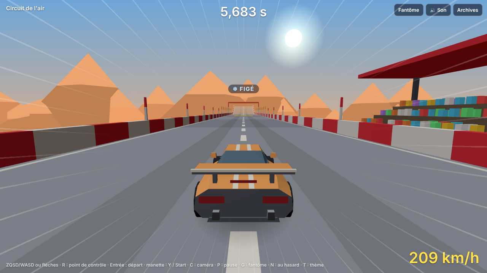

# Lot 19 — Atterrissages et contrôle en l'air

**Essayer** : https://nathan-te.github.io/DailyTrack/b/lot-19-air/?scenario=air — six épreuves, un point de contrôle entre chacune : un **dos d'âne** pris à haute vitesse (le nez pique), un **tremplin `J`** à prendre en braquant (la caisse penche), un **long saut** au super turbo, un **saut dont la réception est un virage relevé**, une **chute de trois niveaux**, un **mur latéral** quitté en l'air.
**Puis les réglages** : https://nathan-te.github.io/DailyTrack/b/lot-19-air/?scenario=air&debug&tune — cinq curseurs « Air : … » (absorption à l'impact, perte selon l'alignement, alignement toléré, amortissement de la rotation, force du frein « figer »). Une course aux réglages modifiés n'est jamais enregistrée ni classée.
**Puis le relief** : https://nathan-te.github.io/DailyTrack/b/lot-19-air/?scenario=relief — les deux sauts du lot 17 avec la nouvelle réception.
**Deux circuits du jour avec de vrais sauts** : https://nathan-te.github.io/DailyTrack/b/lot-19-air/?seed=2026-10-22 (Stade, long saut au super turbo) · https://nathan-te.github.io/DailyTrack/b/lot-19-air/?seed=2026-10-15 (Rallye, saut sur la terre).

(Si l'environnement impose un autre nom de branche, remplacer `lot-19-air` dans le lien ; une fois fusionné, les mêmes adresses marchent sur https://nathan-te.github.io/DailyTrack/ et `/admin/` propose « Air et atterrissages ».)

## Ce qui change pour le joueur

- **On atterrit, on ne rebondit plus.** À l'impact, la vitesse de chute est absorbée ; la vitesse le long du sol est gardée (≈ 100 % quand la voiture est alignée sur le sol). De travers ou sur le nez, la perte est graduée.
- **En l'air, la voiture tourne comme elle a sauté** (plus de retour tout seul à l'horizontale) : une crête prise vite la fait piquer, un tremplin pris en braquant la fait pencher, une sortie de paroi la fait rouler.
- **Le frein, en l'air, fige la caisse** (elle reste dans l'inclinaison où elle est) sans ralentir la voiture. L'accélérateur et la direction n'ont aucun effet en l'air. *Proposition, non appliquée :* un léger lacet à la direction en l'air, si Nathan veut plus de contrôle.
- Un indicateur discret **« ❄ FIGÉ »** s'allume tant que le frein agit en vol ; la caméra suit alors la **direction du déplacement** (et non le cap, qui peut tourner) ; le **son de réception** dépend de sa qualité (un « pof » sourd si elle est propre, un choc plus long et plus craquant sinon) ; la secousse est plus forte pour une mauvaise réception.

## Livré

**Physique** (`packages/sim/src/car.ts`)
- `land` : au premier contact après un vol (≥ 12 sous-pas), la vitesse est décomposée selon la **normale du sol** (moyenne des pentes sous les 4 roues) : la part normale est absorbée à `landAbsorb`, la part tangentielle est multipliée par `keep = 1 − landLoss × (écart − landTolerance)` (entre 0,4 et 1), où l'écart est |tangage − pente du sol devant| + |roulis − pente latérale| (pentes, jamais d'angles). Les vitesses de tangage et de roulis sont amorties de la même façon (la roue qui touche ne relance pas la caisse). Dans une cuve : `landOnShell` (la vitesse normale était déjà supprimée sans rebond par le contact ; la perte selon l'alignement s'y ajoute, la caisse se pose à plat sur la paroi).
- Rotation en vol : tangage, roulis et lacet gardés, amortis à `airDamping` (0,4 /s) ; plus de rappel vers l'horizontale. Un vol de moins de 6 sous-pas (bosse, frôlement d'une paroi) garde l'ancien amortissement fort (`HOP_SUBSTEPS`). Pentes bornées à ±1,6.
- Frein : l'amortissement de la rotation est `airDamping + airFreeze × frein` ; il n'agit que sur la rotation (positions et vitesses linéaires identiques au frein relâché : test).
- Sortie de paroi (`leaveShell`) : la voiture hérite de la **vitesse de rotation** que donne la courbure de la paroi pendant le dernier sous-pas (bornée à 1,5 pente/s), pas de son inclinaison (voir pièges).
- `race.ts` : après l'arrivée, une voiture qui repart en arrière (rebond contre le mur de fin de piste) freine aussi.

**Clés de `CarParams`** (toutes dans `?debug&tune`) : `airDamping` 0,4 · `airFreeze` 14 · `landAbsorb` 0,95 · `landTolerance` 0,3 · `landLoss` 0,7. Supprimées : `airLevel`, `landBounce`.

**Pilote** (`autopilot.ts`) : `needsFreeze(car)` — en vol depuis au moins 6 sous-pas et la caisse tourne (> 0,12 /s sur un axe) — le fait freiner ; la fonction est exportée et les tests de saut l'utilisent (un joueur correct fait pareil). **Fenêtres de vitesse des sauts** (`jump.ts`) : la formule balistique n'a pas changé ; elle a été revérifiée contre la vraie simulation (bissection de `sauts.test.ts`, écart de −3 % à +10 %, avec le frein en l'air).

**Web** : indicateur `#freeze`, caméra stable en vol (`airMix`), `landingQuality` / `landingSound` (audioLogic.ts), `?scenario=air`, entrée « Air et atterrissages » dans `/admin/`, `__cdj.air` pour les tests.

**Scénario** `?scenario=air` : `createAirTrack` (circuits.ts), 76 blocs, 3 rampes de saut, le pilote le finit avec chaque réglage d'adhérence, sur le fond comme sur la paroi (≈ 52 à 56 s).

**Versions** : `SIM_VERSION` **11**, `GENERATOR_VERSION` **11** ; golden (essai + circuits du jour), `history:seed` et `measure:generator` relancés. Le temps de référence du circuit d'essai ne bouge que de 1 ms (32 883 → 32 884) : le sol n'a pas changé.

## Seuils mesurés

`packages/sim/test/air.test.ts` (20 tests) ; mesures sur sol plat, voiture à 35 m/s, chute depuis la hauteur indiquée :

| Réception | montée de la caisse après le contact | vitesse gardée | décollage parasite |
|---|---|---|---|
| chute de 4 m, à plat | 0,2 cm | 100,0 % | non |
| chute de 8 m, à plat | 0,3 cm | 99,9 % | non |
| chute de 12 m, à plat | 0,7 cm | 99,9 % | non |
| 8 m, roulis 0,27 (15°) | 0 | 99,9 % | non |
| 8 m, roulis 0,58 (30°) | 0 | 80,3 % | 4 pas (0,03 s) |
| 8 m, nez −0,6 | 0 | 79,0 % | non |
| 8 m, cabré +0,6 | 0 | 79,0 % | non |
| 8 m, nez −0,58 et roulis 0,3 | 0 | 59,3 % | non |

(Avant le lot : une chute de 4 m avec 0,6 de tangage faisait monter la caisse à 0,7 m et la laissait 39 pas en l'air après le contact.) Le pire cas (caisse sur le côté) est borné à 40 % de pertes.

| Frein en l'air (rotations initiales 2 / −1,5 / 1,2 par seconde) | tangage | roulis | lacet |
|---|---|---|---|
| après 0,05 s, frein appuyé | 48 % | 48 % | 48 % |
| après 0,10 s | 23 % | 23 % | 23 % |
| après 0,30 s | **1,2 %** | 1,2 % | 1,2 % |
| après 0,30 s, frein relâché | 89 % | 89 % | 89 % |

| Saut (vitesse au bord) | rotation au décollage | tangage à la réception, sans frein / figé | vitesse gardée, sans frein / figé |
|---|---|---|---|
| court (45 m/s) | −0,68 pente/s | −0,31 / +0,08 | 99 % / 100 % |
| plat (60 m/s) | −0,60 | −0,34 / +0,07 | 97 % / 100 % |
| long (66 m/s) | −0,69 | −0,40 / +0,08 | 102 % / 102 % |

Un saut ordinaire qu'on ne fige pas coûte donc 0 à 3 % : la tolérance d'alignement (0,3) fait que le frein est un plus, pas une obligation. Un dos d'âne (`U2 D2`) pris à 40 / 52 / 60 m/s fait voler la voiture 1,14 / 1,29 / 1,43 s, avec un tangage qui passe de +0,2 à −0,46 / −0,34 / −0,28 (rotation maximale 0,70 / 0,53 / 0,44 pente/s) : plus on le prend lentement, plus le nez pique, et la réception se paie si on ne fige pas.

Autres tests : un dos d'âne pris à 52 m/s fait décoller la voiture, qui tourne en vol ; accélérateur et direction sont sans effet en l'air (états identiques à la virgule près) ; réception dans une pente (D2), un virage relevé (`L2/b`) et une cuve (`V`) sans rebond ; le pilote finit `?scenario=air` avec les quatre réglages d'adhérence, sur le fond et sur la paroi (8 courses), sans reprise.

## Mesures du générateur (`npm run measure:generator`, 60 dates à partir du 06/10/2026)

| | avant (version 10) | après (version 11) |
|---|---|---|
| dans [30 ; 40] s | 60/60 | 60/60 |
| circuits de secours | 0 | 0 |
| tentative retenue (moyenne / max) | 2,5 / 17 | 2,2 / 12 |
| temps d'auteur moyen | 35,7 s | 35,9 s |
| sauts : Stade, Rallye, Nuit (circuits avec un vrai saut) | 15/15, 13/13, 14/14 | 15/15, 13/13, 14/14 |
| vitesse du pilote au bord de la rampe / plancher (min, moyenne) | 1,14 ; 1,40 | 1,14 ; 1,41 |
| cuves prises sur la paroi par le pilote d'auteur | 21/32 | 20/31 |

Taux de validation par thème (12 dates × 6 tentatives, thème forcé), « pilote finit » / « dans la fenêtre » : Stade 96 % / 54 % → 96 % / 54 % · Rallye 95 % / 45 % → 93 % / 45 % · Banquise 89 % / 43 % → 89 % / 41 % · Nuit 97 % / 55 % → 97 % / 55 % · Campagne 100 % / 48 % → 100 % / 50 %. Aucune règle de génération ajoutée.

## Pièges rencontrés

- Sans auto-nivellement, la caisse qui quitte une rampe pique de ≈ 0,6 pente/s : c'est la **tolérance d'alignement** qui évite de punir un saut ordinaire (la régler sur les cinq types de saut, pas sur une chute à plat).
- Les **petits vols** (frôlement d'une paroi dans un virage en cuve) ne doivent pas garder leur rotation : sans `HOP_SUBSTEPS`, le pilote sortait de la paroi (5 tests de cuves cassés).
- **Ne pas hériter l'inclinaison d'une paroi** : la caisse couchée à 1,5 de roulis a ses roues basses sous la route ; la règle de la « marche trop haute » met alors la vitesse à zéro.
- Le volant est sans effet en l'air : le test « une commande falsifiée change le temps » doit viser une série au sol.
- Le test « le temps de l'auteur n'est jamais plus lent que le pilote sur le fond » ne compare qu'aux courses du pilote qui finissent.

## Non vérifié / décisions pour Nathan

- **Jamais essayé à la main sur un vrai téléphone ni au clavier** : tout est vérifié par les tests et par le pilote. À toi de dire si le « feeling » (rotation 0,4 /s d'amortissement, force du frein 14 /s, tolérance 0,3) te convient ; les cinq curseurs sont dans `?debug&tune`.
- Faut-il un léger lacet à la direction en l'air ? (proposé, non appliqué)
- Le frein en l'air allume la lumière de frein de la voiture (inchangé) ; l'indicateur « FIGÉ » reste discret et sans effet sur la simulation.
