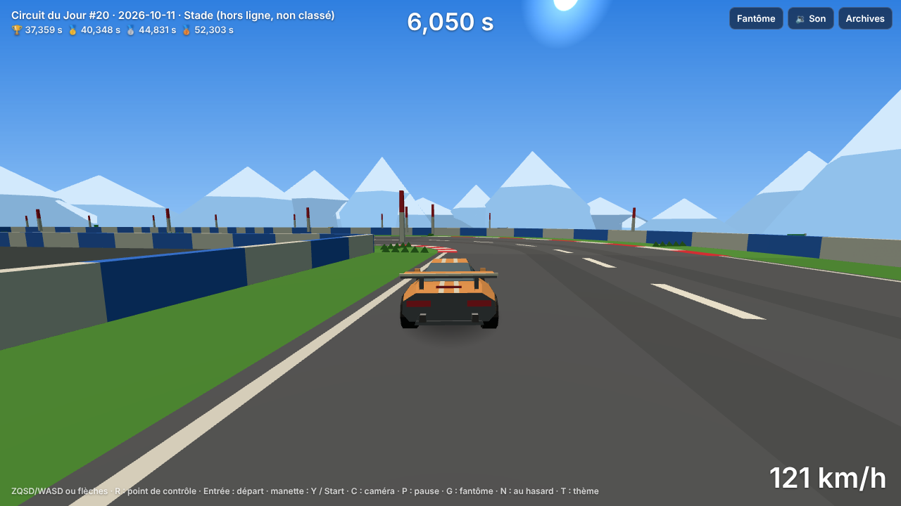
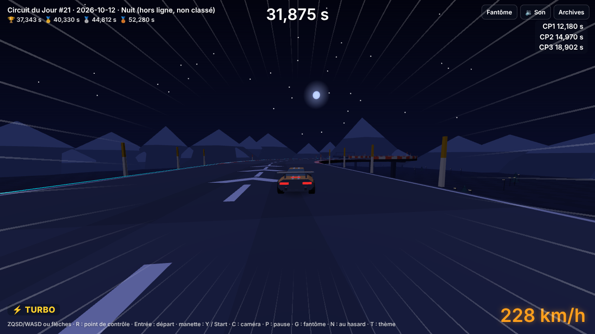
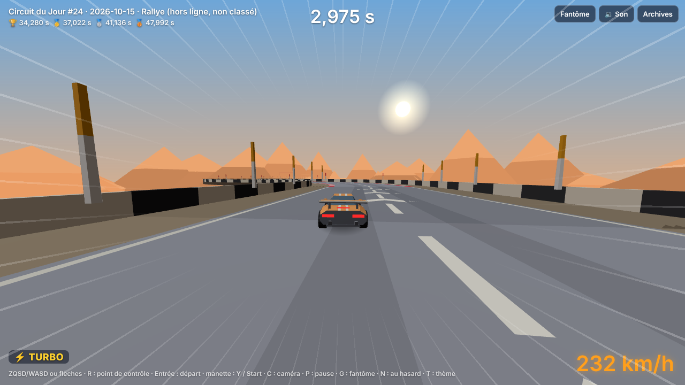
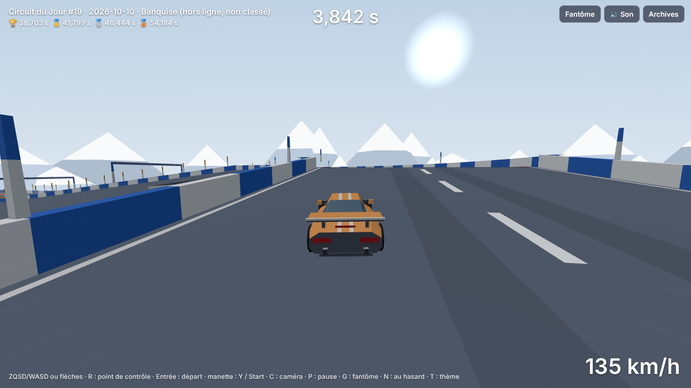
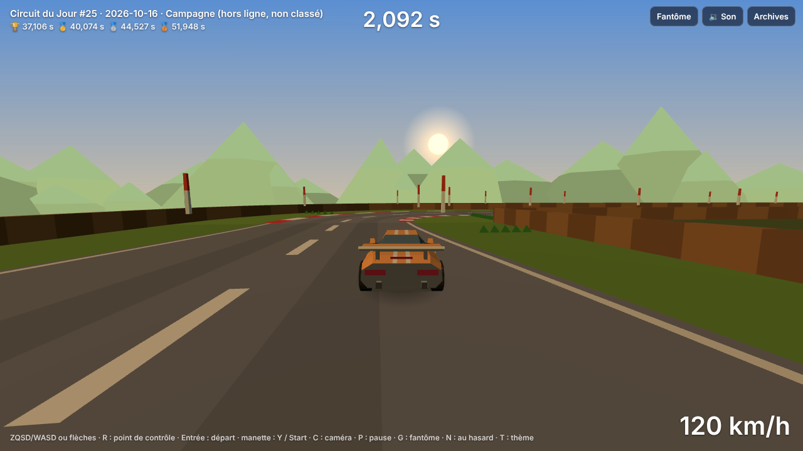
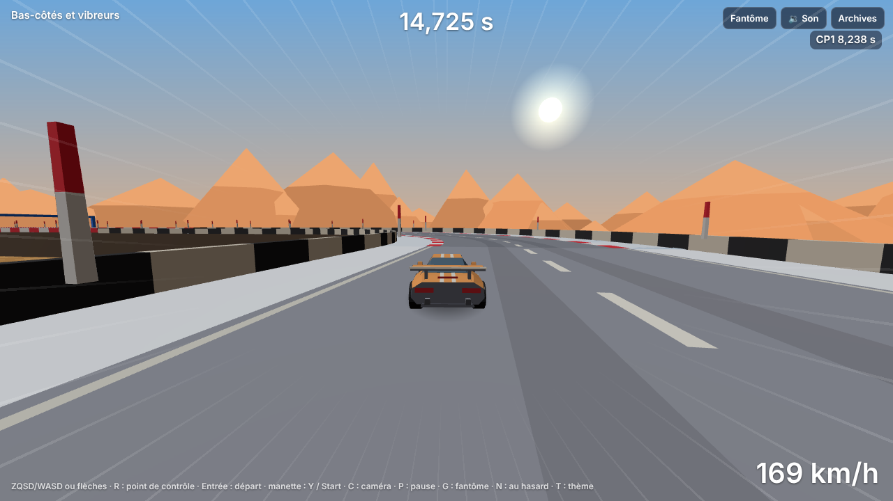

# Lot 21 — Bas-côtés et identité des thèmes

**Essayer** : https://nathan-te.github.io/DailyTrack/b/ccr-f7e643f5-nogspd/?scenario=bas-cotes — un virage par bas-côté, chacun avec ses **vibreurs** : **herbe** (Stade, Campagne), **terre et gravier** (Rallye), **neige poudreuse** (Banquise), **vide** (Nuit) ; une portion de **route bosselée** ; un virage serré bordé d'herbe sur route étroite, à couper… ou pas. Un point de contrôle entre chaque épreuve.
**Puis un circuit par thème** (Stade et Nuit d'abord, pour comparer la lumière) : [Stade](https://nathan-te.github.io/DailyTrack/b/ccr-f7e643f5-nogspd/?seed=2026-10-11) · [Nuit](https://nathan-te.github.io/DailyTrack/b/ccr-f7e643f5-nogspd/?seed=2026-10-12) · [Rallye](https://nathan-te.github.io/DailyTrack/b/ccr-f7e643f5-nogspd/?seed=2026-10-15) · [Banquise](https://nathan-te.github.io/DailyTrack/b/ccr-f7e643f5-nogspd/?seed=2026-10-10) · [Campagne](https://nathan-te.github.io/DailyTrack/b/ccr-f7e643f5-nogspd/?seed=2026-10-16).

(La session impose la branche `ccr-f7e643f5-nogspd` au lieu de `lot-21-identite` ; une fois fusionné, les mêmes adresses marchent sur https://nathan-te.github.io/DailyTrack/ et `/admin/` propose « Bas-côtés et vibreurs ».)

| Stade (plein jour) | Nuit |
|---|---|
|  |  |
| **Rallye** | **Banquise** |
|  |  |
| **Campagne** | **Scénario : neige poudreuse** |
|  |  |

## Ce qui change pour le joueur

- **Des bas-côtés** : là où la route n'a pas de rebord, une bande de revêtement la borde jusqu'à un rebord (muret, pneus, clôture selon le thème). En sortir **ralentit nettement sans faire tomber** : la terre et le gravier un peu, l'herbe beaucoup, la neige poudreuse le plus. **Couper l'intérieur d'un virage est un pari** : parfois on gagne (épingle serrée abordée vite), le plus souvent on perd (virage large).
- **Des vibreurs** rouges et blancs aux deux bords de chaque virage sur route : même adhérence que la route, mais ça gronde, la caméra frémit et le téléphone vibre.
- **Route bosselée** (Rallye) : une tôle ondulée qui allège la voiture — on freine plus long, on tourne moins vif.
- **Chaque thème a sa lumière** : Stade en plein jour (fini la ressemblance avec Nuit), Banquise en jour blanc, Campagne en fin d'après-midi, Nuit en nuit franche avec un néon au bord du vide, Rallye au soleil chaud.

## Livré

**Bas-côtés** (`track.ts`, `world.ts`). Attribut de bloc **chaîné comme la largeur** : `~h` herbe, `~t` terre et gravier, `~p` neige poudreuse, `~v` vide, `~r` retour aux rebords (`S/n~h`, `L2/~t`) ; `o` reste « ce bloc seul sans rebords ». Un bloc qui ne peut pas en porter (départ, arrivée, cuve, vide, rampe, tremplin ; pour une bande : montée, virage relevé, descente de trois niveaux) garde ses rebords sans casser la chaîne. **Largeur** : la bande va du bord de la route à 15 m de l'axe (1 m avant le bord de la cellule) : 8 m de chaque côté sur 14 m, 5 m sur 20 m, 2 m sur 26 m. **Au-delà : un rebord ordinaire** (décidé : jamais de chute depuis une bande ; le vide reste le bas-côté de Nuit). Là où une bande s'arrête contre un bloc plus étroit, une **face de bout** (segment au nez arrondi). La porte d'un point de contrôle couvre la bande.

**Revêtement selon la position en travers** : `world.sample` rend le revêtement du point — route du bloc, vibreur ou bas-côté. Les **vibreurs** (`kerb`, 1,5 m aux deux bords d'un virage sur route) ont **exactement** l'adhérence de la route : un circuit sans bas-côté rejoue **au bit près** (la rediffusion de référence du circuit d'essai n'a changé que d'un octet, celui de la version ; tous les golden de circuits du jour d'avant passaient encore avec les vibreurs seuls).

**Revêtements nouveaux** (`SURFACES`, grip / motricité / roulement) : terre et gravier `0,6 / 0,65 / 4,5`, neige poudreuse `0,42 / 0,5 / 8` ; l'herbe garde `0,5 / 0,55 / 7`.

**Route bosselée** (modificateur `u`, droites, pentes et blocs à effet) : bosses de 0,15 m tous les 6 m, effacées sur la première et la dernière période (polynômes, `rippleAt`) ; dans `world.sample` (hauteur et pente), pas dans `blockHeight`.

**Pilote** (`autopilot.ts`) : sur une route bordée, sa marge au bord passe de 3,6 m (rebord) à 1,1 m (roues sur le vibreur). **Coupe** (`cut`) : le pilote d'auteur refait sa meilleure course en mordant de 0,5 m sur le bas-côté intérieur des virages bordés, et ne la garde que si elle est plus rapide (14 circuits sur 46). Il gère la route bosselée sans règle propre (finit tous les circuits de Rallye mesurés) et ne va jamais sur la neige.

**Identité des thèmes** (`themes.ts`, `generator.ts`) — `Theme.shoulder`, `Theme.bumpy`, `Theme.figures.require` :

| Thème | Lumière | Bas-côté (part des blocs qui peuvent en porter) | Règle propre et réglages |
|---|---|---|---|
| Stade | **plein jour**, soleil haut, ciel bleu, herbe verte (palette `stade`) | herbe 85 %, muret bleu et blanc | cuve et saut toujours ; relevés 70 → 35 % (plus de virages à couper) |
| Rallye | soleil chaud (inchangé) | terre et gravier 75 %, pneus | **route bosselée** (1 ou 2 séries, jamais dans les 3 blocs avant une rampe) ; une **épingle large** (`epingle-terre` ou `demi-tour-large`) ; sauts 40 → 60 % ; aucune section sans rebords (avant : 40 et 50 %) |
| Banquise | **jour blanc** (ciel laiteux, brume proche, lumière diffuse) | neige poudreuse 70 % | glace et roue libre (inchangé) |
| Nuit | nuit franche, **néon au bord du vide** | **le vide** 30 % (jamais sur un serré ni les deux blocs suivants, ni 5 blocs après un super turbo, ni 3 après un saut, ni sur un virage en haut d'une montée) + sections sans rebords | freinages favoris (`turbo-epingle`, `plaque-epingle`) |
| Campagne | **fin d'après-midi**, soleil bas et doré | herbe haute 75 % (plus sombre), clôture de bois | une **crête suivie d'un virage** (`crete-virage` ou `virage-aveugle`) ; aucune section sans rebords (avant : 40 et 50 %) |

Les figures obligatoires ne sont jamais au repos (comme la signature).

**Mesure des moments de choix** (`choices.ts`, `choiceMoments`) : freinages du pilote d'auteur (coups de frein à moins de 0,5 s comptés pour un), passages en roue libre, choix paroi / fond (une par cuve), virages coupables (bordés d'un bas-côté), sauts où le frein a figé la caisse (vols ≥ 0,25 s). Remplace la part du temps à plein gaz comme critère (toujours affichée).

**Web** : rendu des bandes, rebords de thème, faces de bout, vibreurs, tôle ondulée, néon ; palettes refaites (Stade, Banquise, Campagne) avec la hauteur du soleil (`sunHeight`) ; décor « drapeaux, haies, panneaux » pour le Stade ; grondement et vibration des vibreurs (`tel.kerb`, `rollVoice`), particules de gravier et de neige, bandeau « GRAVIER » / « NEIGE POUDREUSE » ; ligne « Bas-côtés » de la carte d'un jour dans l'admin ; miniature 2D avec ses bandes (`THUMB_VERSION` 2) ; `?scenario=bas-cotes` et son raccourci dans `/admin/`.

**Versions** : `SIM_VERSION` **12**, `GENERATOR_VERSION` **13** ; golden (essai et circuits du jour), `history:seed` et `measure:generator` relancés ; jour de test de l'API (14/10/2026) revérifié : les tests de l'API passent tels quels.

## Seuils mesurés (`packages/sim/test/basCotes.test.ts`, 16 tests)

- Partie à 45 m/s, 2 s à plein gaz : route > 47 m/s ; terre et gravier < 42 ; herbe < gravier − 3 ; **neige < herbe − 1,5**. Pointes à plat : ≈ 38 / 27 / 20 m/s (> 35, > 25, > 18), dans cet ordre.
- Braquages au hasard (6 graines × 3 bas-côtés, 25 s) : jamais de chute, jamais hors du sol.
- Face de bout : lancée à 45 m/s sur la bande (à 11, 9 et 7,6 m de l'axe), la voiture bute et ne se déplace jamais de côté (< 5 cm par pas) ; sur la route elle passe. À 88 m/s (`vitesse.test.ts`) : ni le rebord d'une bande, ni la face devant un bloc à rebords ou une cuve ne se traversent.
- **Couper** : épingle serrée après un super turbo, coupe de 1 m → **plus rapide de plus de 0,5 s** ; virage large, coupe de 2 m → **plus lent de plus de 0,3 s**.
- Route bosselée : freinage 45 → 15 m/s plus long d'au moins 10 % (mesuré +16 %), écart latéral en 0,6 s de braquage au plus 80 % du plat (mesuré 60 %), pointe à 1 m/s près ; le pilote finit un circuit bosselé.
- Au bit près : la même course, avant d'atteindre les bas-côtés, donne le même état qu'un circuit sans bas-côtés.
- `generator.test.ts` (identité des thèmes) : sur 60 dates + 4 dates par thème imposé, chaque thème a ses bas-côtés et seulement les siens, jamais sur un bloc qui ne peut pas en porter ; Rallye a toujours sa route bosselée et une épingle large, Campagne sa crête suivie d'un virage, Stade et Nuit un saut et une cuve ; la route bosselée n'existe qu'en Rallye ; chaque thème a sa palette.

## Mesures (`npm run measure:generator`, même machine)

| | avant (lot 20) | après |
|---|---|---|
| temps d'auteur (60 dates) | 31,7 – 40,0 s, moyenne 37,5 s, 60/60 dans la fenêtre | 32,7 – 39,8 s, moyenne 37,3 s, 60/60 |
| génération (moyenne / pire) | 195 / 903 ms | 188 / 974 ms |
| rejeu d'une course d'auteur | 51,7 ms | 51,4 ms (voir plus bas) |
| dans la fenêtre, par thème (Stade / Rallye / Banquise / Nuit / Campagne) | 75 / 67 / 37 / 70 / 69 % | 76 / 62 / 32 / 60 / 67 % |
| pilote finit (Nuit) | 97 % | 94 % |

**Bas-côtés par thème** (part des blocs) : Stade herbe 55 %, Rallye gravier 64 %, Banquise neige 56 %, Nuit vide 21 %, Campagne herbe 68 %. Route bosselée : Rallye 13/13. Règle propre : Rallye 13/13, Campagne 4/4.

**Moments de choix par circuit** (60 dates, moyenne) :

| thème | freinages | roue libre | paroi / fond | virages coupables | sauts figés | total (min) |
|---|---|---|---|---|---|---|
| Stade | 3,7 | 3,0 | 1,0 | 1,7 | 3,1 | 12,5 (8) |
| Rallye | 3,5 | 4,2 | 0 | 4,7 | 3,1 | 15,5 (10) |
| Banquise | 5,1 | 8,6 | 0,3 | 4,3 | 2,5 | 20,7 (14) |
| Nuit | 3,1 | 2,6 | 1,0 | 0 | 3,7 | **10,5** (8) |
| Campagne | 5,0 | 2,8 | 0 | 4,5 | 2,5 | 14,8 (14) |
| ensemble | 3,9 | 4,5 | 0,6 | 2,7 | 3,1 | 14,7 |

**Nuit est nettement plus pauvre** (≈ 70 % de la moyenne) : son bas-côté est le vide, qui ne se coupe pas, et elle a peu de virages à freinage franc ; Stade suit (85 %). Banquise est la plus riche (la roue libre sur glace). Pistes, non appliquées : compter un virage au bord du vide comme un choix (trajectoire sûre ou serrée), ou donner à Nuit un bas-côté mixte (vide sur les parties hautes, une bande ailleurs).

**Couper par le bas-côté** (même pilote, 46 circuits à bas-côtés) : 0,5 m → plus rapide sur 14, plus lent sur 30 ; 1 m → 3 / 41 ; 3 m → 2 / 42 : couper paie rarement, et seulement de peu (sauf une épingle abordée trop vite).

**Coût d'un rejeu** : voir la section « Vérifications » de la PR (mesuré en alternance avec `main` sur la même machine).

## Pièges

- **Une bande qui s'arrête doit finir par un mur** : sans face de bout, une voiture lancée sur la bande entrait dans le bloc suivant à 5 m hors de sa route, et la collision latérale de ce bloc la téléportait de 5 m. La face est un segment (nez arrondi) testé dans le bloc à bas-côtés lui-même, avant que le disque ne change de cellule.
- **Le vide de Nuit fait tomber le pilote** à la sortie d'un virage serré (il sort large) : un circuit de Nuit sur six n'était plus fini ; d'où les exclusions (serré et deux blocs après, super turbo, saut, virage en haut d'une montée).
- **Une route bosselée avant une rampe** : les pilotes prudents du jeu de démonstration n'atteignaient plus la vitesse du saut (7 pilotes écartés sur 14 un jour de Rallye) : pas de tôle ondulée dans les trois blocs avant une rampe.
- **« Couper de 0,5 m » ne coupait rien** tant que la marge du pilote au bord était de 1,6 m : la mesure semblait dire que couper paie, alors que seule la route était mieux utilisée. La marge est passée à 1,1 m (roues au bord) avant de mesurer la coupe.
- **Compter les freinages du pilote** : il freine par petits coups (tout ou rien), 30 à 50 « freinages » par circuit ; deux coups à moins de 0,5 s d'intervalle n'en font qu'un.
- **Captures** : en pas à pas (`manual`), le jeu ne dessine pas ; on avance jusqu'au pas voulu, on met en pause, on repasse en temps réel et on masque le panneau de pause (`e2e/captures.spec.ts`).

## Non vérifié

- Sur un vrai téléphone : vibration des vibreurs, lisibilité des bandes en petit, coût de rendu des bandes (deux fois plus de triangles de route) — à mesurer au lot 23 avec la refonte graphique.
- Firefox et WebKit : la CI les lance (le calcul est le même : aucune fonction nouvelle hors des opérations permises, `purete.test.ts`).
