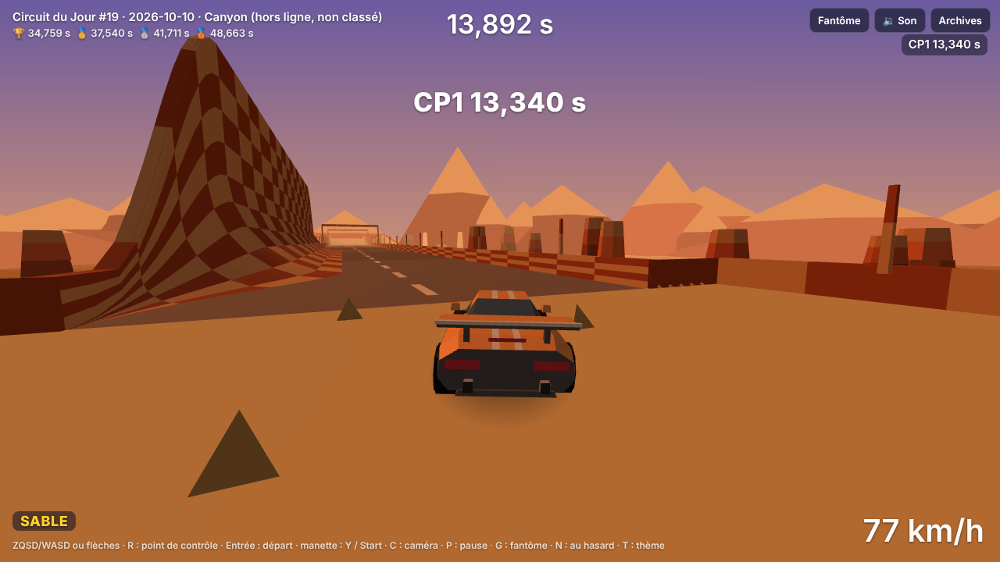
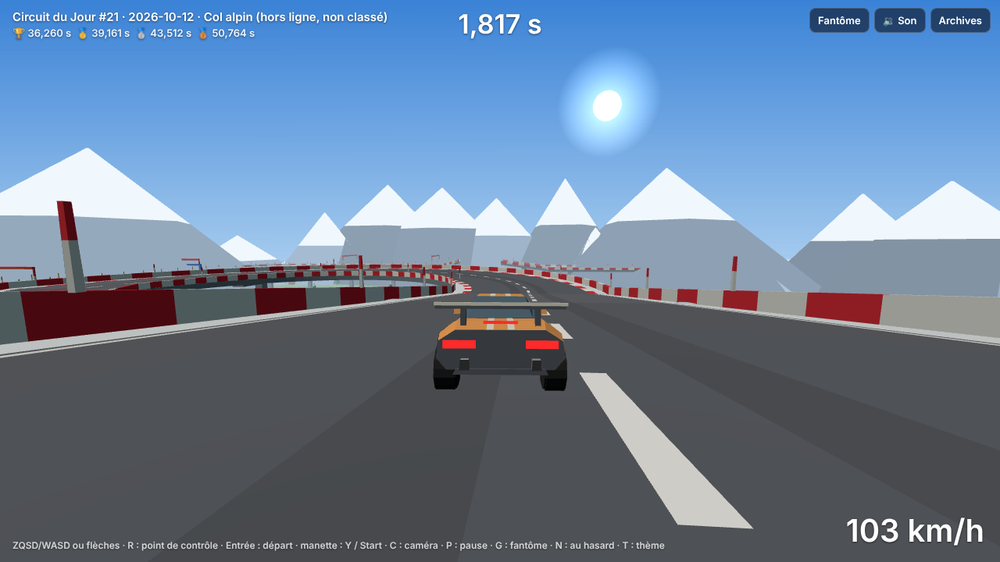
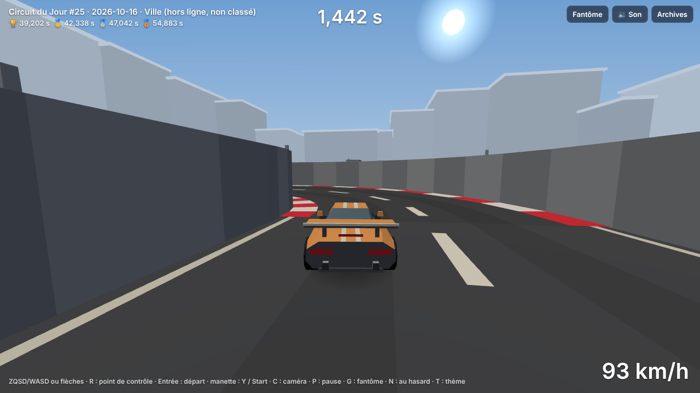

# Lot 22 — Nouveaux thèmes : Canyon, Col alpin, Ville

**Essayer** (aperçu de la branche `claude/seed-doc-origin-main-lot-22-ocd9sa`, publié par `pages.yml`) — deux circuits par nouveau thème, le premier en premier :

| Thème | Circuit 1 | Circuit 2 | À constater |
|---|---|---|---|
| **Canyon** | [?seed=2026-10-10](https://nathan-te.github.io/DailyTrack/b/claude-seed-doc-origin-main-lot-22-ocd9sa/?seed=2026-10-10) | [?seed=2026-10-31](https://nathan-te.github.io/DailyTrack/b/claude-seed-doc-origin-main-lot-22-ocd9sa/?seed=2026-10-31) | soleil rasant, **sable** (bandeau « SABLE », poussière qui traîne), parois de roche, un **long saut** après la paroi |
| **Col alpin** | [?seed=2026-10-12](https://nathan-te.github.io/DailyTrack/b/claude-seed-doc-origin-main-lot-22-ocd9sa/?seed=2026-10-12) | [?seed=2026-10-15](https://nathan-te.github.io/DailyTrack/b/claude-seed-doc-origin-main-lot-22-ocd9sa/?seed=2026-10-15) | matin clair, **descente en lacets**, neige en bas-côté, sections au-dessus du vide |
| **Ville** | [?seed=2026-10-16](https://nathan-te.github.io/DailyTrack/b/claude-seed-doc-origin-main-lot-22-ocd9sa/?seed=2026-10-16) | [?seed=2026-10-29](https://nathan-te.github.io/DailyTrack/b/claude-seed-doc-origin-main-lot-22-ocd9sa/?seed=2026-10-29) | jour, béton, **murs hauts**, **angles droits** en chicane, immeubles et lampadaires |

Pour comparer sur n'importe quelle date : `?seed=…&theme=canyon|col|ville` (essai, jamais classé) ; `/admin/` propose les trois dans « thème forcé » et dans le remplacement du planning. (La session impose la branche ci-dessus au lieu de `lot-22-nouveaux-themes` ; fusionné, les mêmes adresses marchent sur https://nathan-te.github.io/DailyTrack/.)

| Canyon | Col alpin | Ville |
|---|---|---|
|  |  |  |

## Ce qui change pour le joueur
- **Huit thèmes au lieu de cinq**, toujours tirés de la date. Attention : le tirage passe de 5 à 8 issues, donc **le thème (et le circuit) de chaque date a changé**, y compris pour les anciens thèmes (`GENERATOR_VERSION` +1).
- **Sable** : lent mais stable. On y garde la trajectoire (adhérence 0,8, motricité 0,7) mais ça freine fort (roulement 6 m/s²) ; en bas-côté c'est la bande de Canyon, en revêtement de bloc ce sont des zones de piste.
- **Canyon** : sable, parois rocheuses (murs latéraux et virages en cuve habillés en roche rouge et ocre), longs sauts au-dessus des ravins ; **signature** : une paroi qui donne l'élan, une plaque ou un super turbo, puis la rampe (`paroi-long-saut`).
- **Col alpin** : grosses descentes, **lacets** (virages larges et demi-tours dans la pente), glissières rouges et blanches, neige poudreuse en bas-côté, plaques de glace possibles, sections **sans rebords** au-dessus du vide ; **signature** : `lacets`.
- **Ville** : route étroite ou normale entre des murs (dessinés à 3,4 m, la physique des rebords ne change pas), aucun bas-côté, **jusqu'à 4 virages serrés** (« angles droits ») ; **signature** : `chicane-angles` (angle droit, droite, angle droit dans l'autre sens).

## Livré
- **Sable** (`track.ts`, `world.ts`) : `SurfaceKind` et `BlockSurface` gagnent `sand` ; notation `S/s` (bloc) et `~s` (bas-côté) ; `SURFACES.sand` = `0,8 / 0,7 / 6` ; une ligne de plus dans chaque table du web (`SURFACE_COLORS`, `SURFACE_MARKS`, `DUST`, `SKID_STYLE`, `SURFACE_SOUNDS`, `SURFACE_HUD`, `SURFACE_LABEL`).
- **Thèmes** (`themes.ts`) : `canyon`, `col`, `ville` (palette, zones, largeurs, relief, sauts, cuves, sections ouvertes, figures favorites et interdites, signature) ; `THEME_NAMES` à 8, `themeForDay` tire sur 8 ; `Theme.maxTight` (4 pour Ville) et `maxTightOf` ; 3 palettes sim (`canyon`, `alpin`, `ville`).
- **Figures** (`figures.ts`) : `paroi-long-saut` (canyon), `lacets` (col, 4 variantes dont une **en montée** : sans elle, 40 % des tentatives sortaient des hauteurs permises), `chicane-angles` et `u-urbain` (ville) ; nouveau drapeau `Figure.only` : une figure propre à un thème ne sort que chez lui (la bibliothèque passe à 44 figures, les cinq anciens thèmes ne voient aucune nouvelle figure).
- **Générateur** (`generator.ts`) : `maxTightOf(theme)` remplace la constante ; `ownedBy` filtre le tirage et les remplaçantes ; signatures `rockJump`, `switchbacks`, `rightAngles` ; les bas-côtés de sable passent par `assignShoulders` comme les autres.
- **Web** : palettes `canyon` (soleil à 0,2, mesas), `alpin` (sapins, blocs, chalets), `ville` (immeubles à fenêtres, lampadaires, skyline à toit plat, rebords à `wallHeight` 3,4 m) ; `signatureBlocks` cadre la paroi et le saut, les lacets, la chicane d'angles droits (miniatures et archives) ; admin, archives et thème suivant (**T**) lisent `THEME_NAMES`.
- **Versions** : `SIM_VERSION` **13**, `GENERATOR_VERSION` **14** ; golden, `history:seed` (le jeu de démonstration pioche maintenant dans toute la liste de pseudos jusqu'à avoir ses 8 à 15 pilotes : le Rallye du 02/10 n'était fini que par des pilotes très sûrs) et mesures refaits.

## Mesures (60 dates, `npm run measure:generator` ; les chiffres sont recopiés dans les tests)
| Revêtement à plat, plein gaz 30 s | route | gravier | **sable** | herbe | neige |
|---|---|---|---|---|---|
| pointe (m/s) | 48,0 | 37,7 | **35,0** | 27,3 | 20,0 |

- **Thèmes du jour sur 60 dates** : stade 10 · rallye 8 · banquise 6 · nuit 4 · campagne 8 · **canyon 8 · col 9 · ville 7** ; sur 80 dates chacun apparaît (`nouveauxThemes.test.ts`). Aucun circuit de secours ; durées d'auteur 31,1–40,0 s (moyenne 37,1 s), 60/60 dans la fenêtre ; vitesse maximale du pilote ≥ 62,4 m/s sur 60/60.
- **Taux de validation par thème** (12 dates × 6 tentatives, thème forcé) :

| thème | construit | pilote finit | dans la fenêtre | durée moyenne | génération / tentative |
|---|---|---|---|---|---|
| stade | 88 % | 98 % | 76 % | 38,2 s | 151 ms |
| rallye | 81 % | 98 % | 62 % | 39,6 s | 80 ms |
| banquise | 94 % | 88 % | 32 % | 41,0 s | 115 ms |
| nuit | 90 % | 94 % | 60 % | 39,4 s | 136 ms |
| campagne | 79 % | 93 % | 67 % | 38,7 s | 80 ms |
| **canyon** | 65 % | 98 % | **79 %** | 37,1 s | 109 ms |
| **col** | 89 % | 94 % | **50 %** | 40,1 s | 88 ms |
| **ville** | 78 % | 96 % | **82 %** | 38,2 s | 55 ms |

  Les trois nouveaux thèmes sont au niveau des anciens (Banquise reste le plus bas, comme avant le lot ; *Col* y est un peu plus long : les lacets pèsent dans le budget).
- **Moments de choix** (moyenne par circuit, 60 dates) : stade 13,5 · rallye 15,5 · banquise 18,8 · nuit **10,3** (toujours la plus pauvre) · campagne 13,9 · **canyon 13,3 · col 17,0 · ville 14,0** · ensemble 14,7. Les nouveaux thèmes sont au niveau des autres.
- **Ville** : au plus **4** virages serrés sur 60 dates (le script affiche « max 4 » pour l'ensemble, les sept autres thèmes restent à 2) et sur 80 compositions ; jamais deux de suite, jamais sur la route large (`nouveauxThemes.test.ts`).
- **Coût d'un rejeu** (même machine, avant / après, alterné ×3, course d'essai) : ≈ 11,7–12,0 ms sur `main` contre ≈ 11,4–12,8 ms sur la branche : **inchangé** (le sable n'ajoute qu'une ligne de table). Rejeu d'une course d'auteur : 51 ms en moyenne (max 90 ms).
- **Poids** : `perf.spec.ts` ; code du jeu et de la simulation hors three.js ≈ 85,7 ko compressés (budget relevé de 84 à 90 ko : trois palettes, trois décors, quatre figures).

## Garde-fous
- `packages/sim/test/nouveauxThemes.test.ts` (sable : notation, pointes, braquages au hasard sans chute ; rotation sur huit ; figures propres ; Canyon, Col, Ville ; validation par le pilote) ; `vitesse.test.ts` (88 m/s sur une bande et un bloc de sable) ; `basCotes.test.ts` (braquages au hasard sur `~s`) ; `figures.test.ts` valide chaque variante des nouvelles figures, dans les deux sens, sur les trois largeurs ; `thumbFocus.test.ts` (signatures).
- Tests existants adaptés (et pourquoi) : virages serrés « au plus 2 » (Ville : 4) ; ratio virages larges / serrés (Ville comptée à part) ; sauts « > 40 » → « > 30 » (Col et Ville ont peu de sauts) ; paroi la plus rapide « Stade et Nuit » (au Canyon la paroi précède un saut : le pilote garde le fond) sur 40 jours.

## Limites et décisions pour Nathan
- **Tous les circuits de toutes les dates changent** (tirage sur 8) : prévu par le prompt, à garder en tête pour les rediffusions déjà jouées (aucun joueur réel).
- **Ville** : `wallHeight` ne change que le dessin des rebords ; en l'air, une voiture lancée peut encore passer à travers le mur dessiné de 3,4 m (la physique garde 1,4 m).
- **Col alpin** : « plaques de glace possibles » = zones de 0 à 2 séries de blocs sur glace ; les figures de glace de Banquise lui sont interdites.
- Nuit reste le thème aux moments de choix les plus rares (10,3) : voir les leviers du § 9 de l'orchestration.
- À regarder sur un vrai téléphone : lisibilité du sable (couleur proche du sol du Canyon) et coût de rendu du décor de Ville (immeubles à fenêtres).
