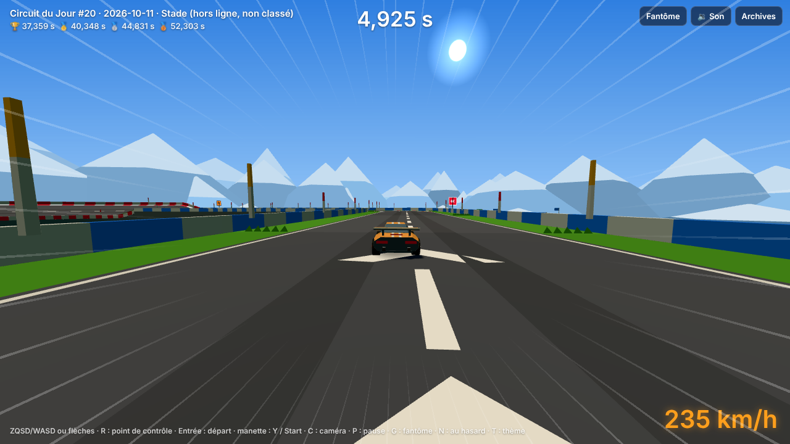
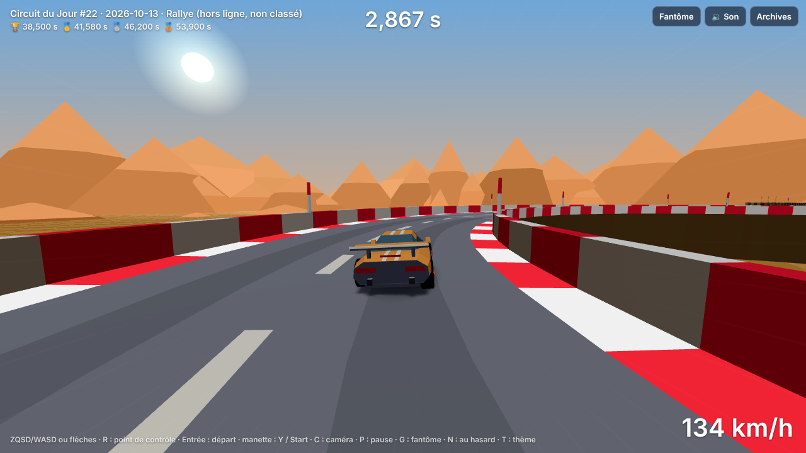
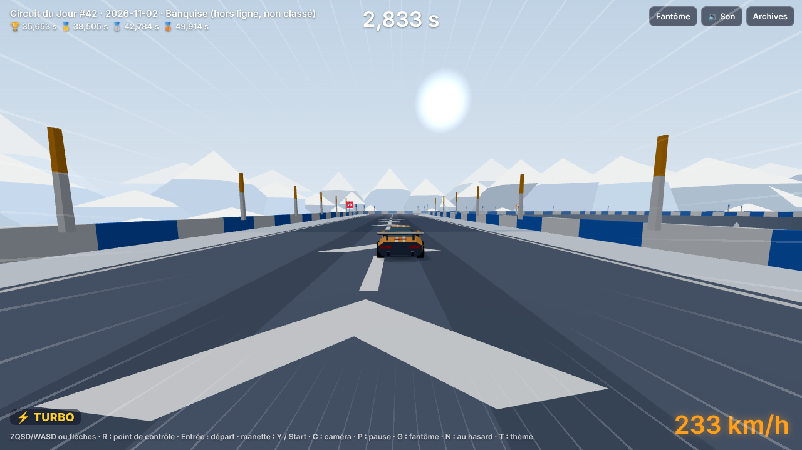
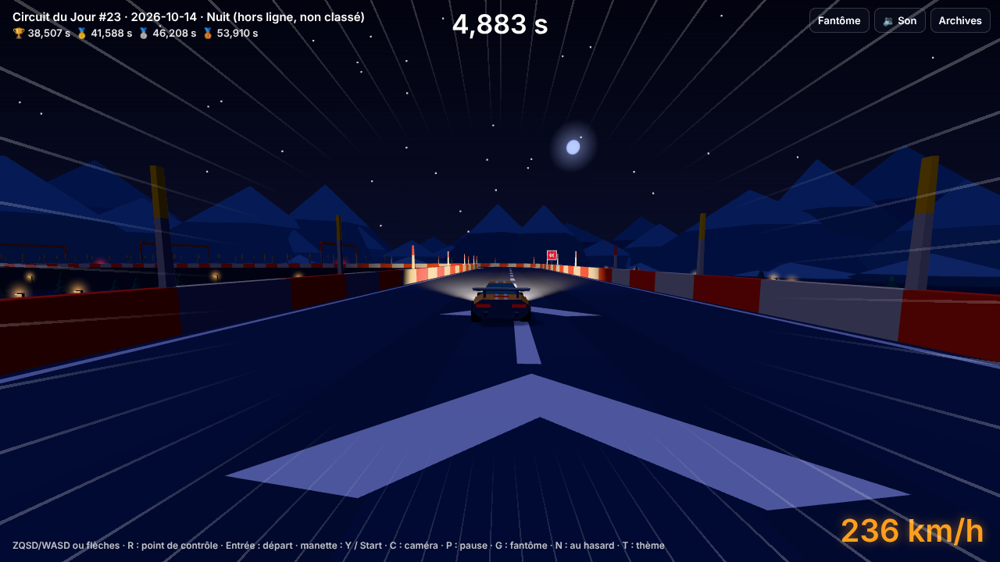
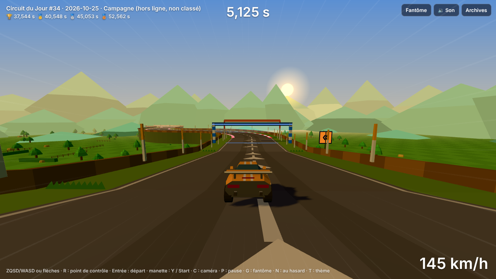
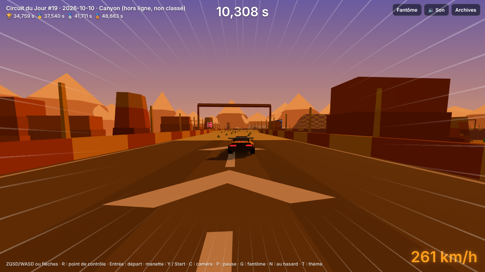
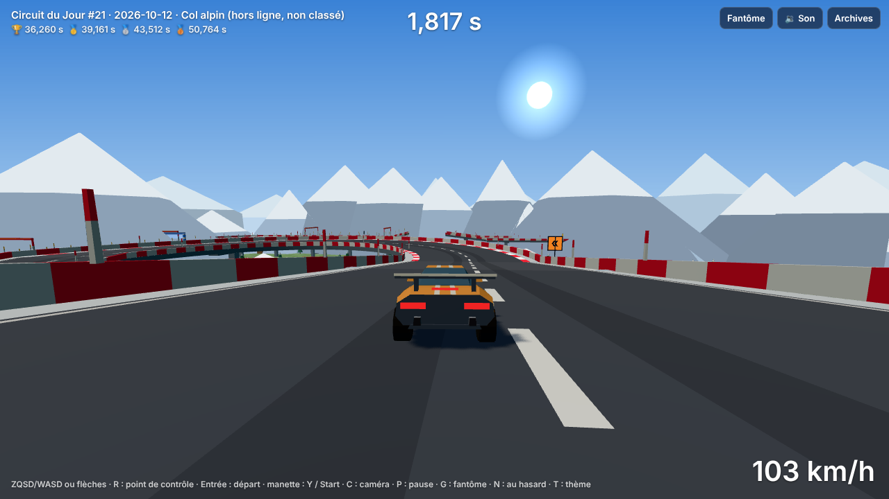
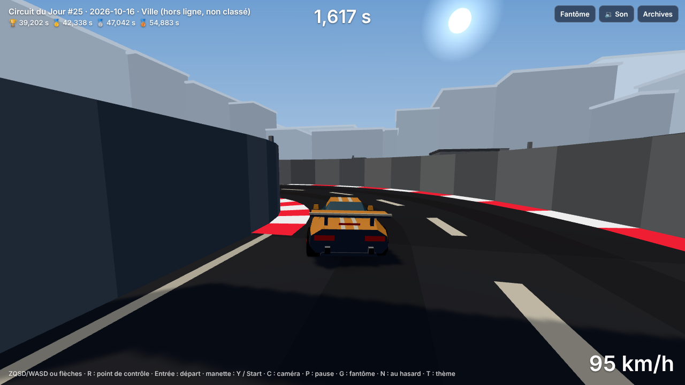
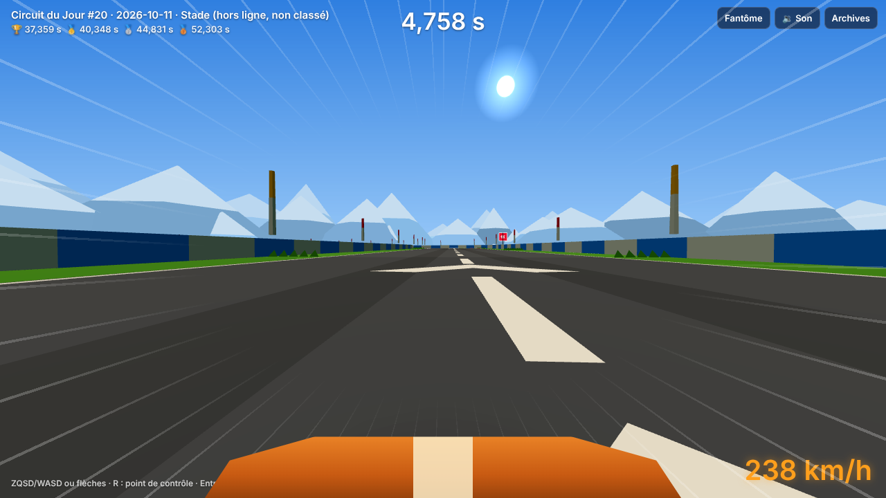

# Lot 23 — Graphismes, ambiance et caméras

**Règle du lot : rendu seul.** `packages/sim` n'a pas bougé (`git diff packages/sim` vide, golden et `SIM_VERSION` / `GENERATOR_VERSION` inchangés).

## À essayer

Un lien par thème (le circuit du jour de la date indiquée ; sur l'aperçu de la branche, remplacer la base par celle de l'aperçu publié par `pages.yml`, ou ouvrir `?seed=…` sur `npm run dev`). Pour un autre thème sur n'importe quelle date : `?seed=…&theme=<nom>` (essai, jamais classé).

| Thème | Lien | À constater |
|---|---|---|
| Stade | `?seed=2026-10-11` | plein soleil, ombres nettes, tribune, drapeaux |
| Rallye | `?seed=2026-10-13` | poussière, soleil franc, brise |
| Banquise | `?seed=2026-11-02` | jour blanc, brume laiteuse, ombres douces |
| Nuit | `?seed=2026-10-14` | **phares**, halos des lampadaires et néons, bourdonnement |
| Campagne | `?seed=2026-10-25` | fin d'après-midi, ombres longues, clôtures et haies, grillons |
| Canyon | `?seed=2026-10-10` | soleil rasant, falaises à strates, vent chaud |
| Col alpin | `?seed=2026-10-12` | air limpide, sapins, muret de pierre, vent |
| Ville | `?seed=2026-10-16` | voile de ville, murs hauts, rumeur urbaine |

**Sur le téléphone** : ouvrir `?seed=2026-10-14&touch=1` (Nuit, le plus chargé) ; le bouton 🎥 est le premier de la barre du bas ; `&zones=1` dessine les zones tactiles ; `&camera=capot` impose la caméra capot.

Captures (circuit du pilote d'auteur, un peu avant le premier virage ; qualité 2, effets coupés) :

| | | |
|---|---|---|
|  |  |  |
|  |  |  |
|  |  |  |

La dernière image est la **caméra capot** (Stade).

## Livré

**Lisibilité**
- **Panneaux de direction** : `signage.ts` (pur, testé) calcule où en planter un avant chaque virage, saut ou cuve : côté extérieur du virage, sur le dernier bloc droit fermé qui précède (jusqu'à 3 blocs avant), jamais au départ, sur une porte ni sur un bloc sans rebord. Chevrons : 1 (ample, jaune), 2 (large, orange), 3 (serré, rouge) ; tremplin orange ; cuve bleue avec la paroi annoncée. Plaques sans éclairage, donc lisibles de nuit. Sur 30 dates, plus de 85 % des virages serrés précédés d'un bloc droit sont annoncés (test).
- **Arche de départ** (« DÉPART ») et **d'arrivée** (« ARRIVÉE », damier) ; **portes de contrôle** plus hautes (7,5 m), poteaux à bandes, poutre lumineuse, voile translucide sous la poutre, halos aux coins ; **vibreurs** rouge et blanc sans éclairage.

**Lumière et ambiance par thème** (`LOOKS`, une entrée par palette)
- Tonalité douce (`NeutralToneMapping`) et **exposition** propre au thème, aussi dans les miniatures.
- **Brume** : sa densité est un trait du thème (Ville et Banquise plus voilées, Col alpin et Stade plus limpides).
- **Ombres portées** : carte qui suit la voiture (±42 m) ; la voiture et les accessoires en projettent, la route et le sol en reçoivent ; intensité par thème (lumière rasante = ombres longues). Le décor reçoit mais ne projette pas (voir mesures).
- **Halos** sur néons, lampadaires, pylônes, plaques, turbos et portes : un seul `Points` additif.
- **Phares** sur Nuit : un projecteur devant la voiture (éteint de jour, jamais retiré : pas de recompilation).

**Décor** : passe dense (qualité 2) avec clôtures et haies (Campagne), falaises à strates (Canyon), murets (Col alpin), rangées de sapins (Banquise) ; **silhouettes en trois couches** (lointaine pâle, anneau d'origine, collines proches sombres).

**Ambiance sonore** (procédurale, aucun fichier : rien à créditer) : foule (Stade), brise (Rallye), vent (Banquise, Col alpin), vent chaud (Canyon), grillons (Campagne), rumeur urbaine (Ville), bourdonnement électrique (Nuit). Sous le volume général (**M** la coupe), couverte peu à peu par la vitesse (100 % → 40 %), silencieuse en pause.

**Caméras** : proche, loin, **capot** (très basse, devant le centre de la voiture, carrosserie cachée, museau dessiné en bas de l'écran). Touche **C**, bouton Vue de la manette, **bouton 🎥 de la barre tactile** (premier de la barre, à ≈ 34–39 % de la largeur : au moins 14 px de toute frontière entre zones, mesuré). Choix mémorisé (`cdj:camera`) ; `?camera=` l'impose ; option « Caméra » dans `/admin`.

**Niveaux de qualité** (`QualityGovernor` → `TrackScene.setQuality`)

| | 0 | 1 | 2 |
|---|---|---|---|
| ombres | non | 512 | 1024 |
| halos, phares | non | oui | oui |
| décor de base, ciel, silhouettes | non | oui | oui |
| décor dense, collines proches | non | non | oui |

Panneaux, arches, portes, vibreurs : toujours (c'est de la lisibilité).

## Mesures

Fil principal par image (CDP `Performance.getMetrics`, profil mobile 844 × 390 @2, **CPU ×4**, rendu logiciel, démo du pilote, caméra « loin » des deux côtés, 4,5 s après 9 s d'échauffement). `avant` = `main` au début du lot. Bruit ≈ ± 3 ms : ordre de grandeur.

| Scène | q0 avant → après | q1 avant → après | q2 avant → après |
|---|---|---|---|
| pilotage | 10,7 → 13,2 | 11,2 → 16,5 | 11,6 → 15,2 |
| nuit | 12,4 → 15,1 | 13,0 → 18,1 | 13,6 → 21,8 |
| ville | 10,6 → 14,3 | 12,8 → 14,4 | 14,8 → 27,2 |
| canyon | 12,9 → 12,6 | 11,2 → 16,6 | 16,1 → 13,8 |

Après la mesure, le décor a cessé de projeter des ombres (il coûtait le plus : Ville et Nuit en qualité 2) ; nouvelle mesure partielle : nuit 14,1 / 15,8 / 21,6 et ville 14,1 / 23,1 / 14,2 aux qualités 0 / 1 / 2. Lecture : **+1 à +6 ms** en qualité 1 et 2 à ×4 (à 60 i/s le budget est 16,7 ms) ; Nuit en qualité 2 reste le plus lourd (≈ 22 ms) : phares, halos, décor dense. La qualité automatique baisse d'un cran au-delà de 26 ms d'intervalle moyen, donc un téléphone lent perd ombres et décor dense avant de ramer. **À confirmer sur un vrai téléphone.**
Piège rencontré : une première série donnait 50–90 ms par image sur Canyon : ce n'étaient pas les graphismes mais la **compilation des shaders** des premiers effets et du premier changement de caméra de la démo, tombée dans la fenêtre de mesure (profil : `getShaderInfoLog`). La mesure attend maintenant 9 s.

**Poids ajouté** : ≈ +5,6 ko compressés (code du jeu et de la simulation hors three.js : 85,7 → 91,3 ko ; total 222,6 ko), three.js inchangé ; budgets de `perf.spec.ts` relevés (228 ko au total, 96 ko hors three.js).

**Miniatures** : seule la tonalité et l'exposition du thème s'ajoutent (un réglage du rendu final : coût nul) ; ni ombres, ni halos, ni panneaux, ni bandeaux de texte dans la vue aérienne.

## Tests
- `apps/web/test/graphismes.test.ts` (13) : caméras (ordre, mémoire, capot bas et devant), ambiances (une par palette, six types, volume), lumière (phares seulement la nuit, brume), panneaux (côté, sévérité, cuve, saut, jamais au départ, un par hôte, ≥ 85 % annoncés sur 30 dates).
- `e2e/cameras.spec.ts` (6) : C fait le tour clavier, carrosserie cachée au capot, choix mémorisé après rechargement ; bouton 🎥 au toucher sur Android et iPhone (gaz automatique et deux pédales) ; écart ≥ 14 px avec chaque frontière ; aucun appui autour des frontières ne change la caméra (`?zones=1`).
- `e2e/graphismes.spec.ts` : ambiance de chacun des huit thèmes, panneaux présents, brume propre au thème, aucune erreur de page ; niveaux de qualité (ombres 0 / 512 / 1024, halos, phares, décor dense, collines) ; M et ambiance.
- Outils : `e2e/captures-lot23.spec.ts` (`CAPTURES=1`), `e2e/mesure-lot23.spec.ts` (`MESURE=1`).

## Non vérifié / à décider
- **Vrai téléphone** : coût des ombres, halos et décor dense (voir mesures) ; lisibilité des panneaux en plein soleil ; position du bouton 🎥 sous le pouce.
- **Son** : aucun test n'écoute ; les niveaux des ambiances (foule, grillons surtout) sont à juger à l'oreille (`AMBIENCE` dans `audioLogic.ts`). iOS : non vérifié.
- Goût : puissance des phares (`HEADLIGHT_POWER`), taille des panneaux (2,5 m), densité du décor dense, museau de la caméra capot (un aplat orange, pas la vraie caisse).
- Les halos s'effacent de près (au-delà de ≈ 190 px) pour éviter un carré sur les petits GPU.
