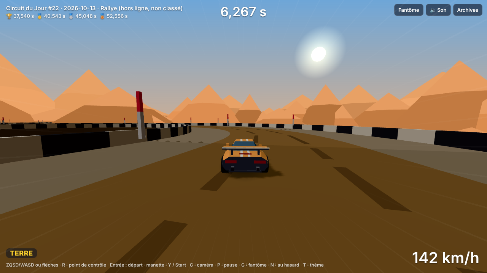
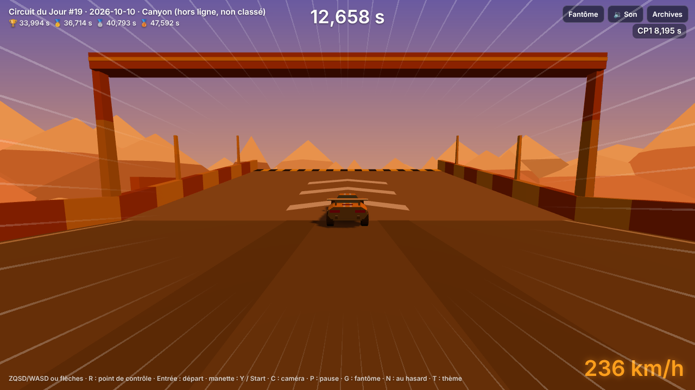
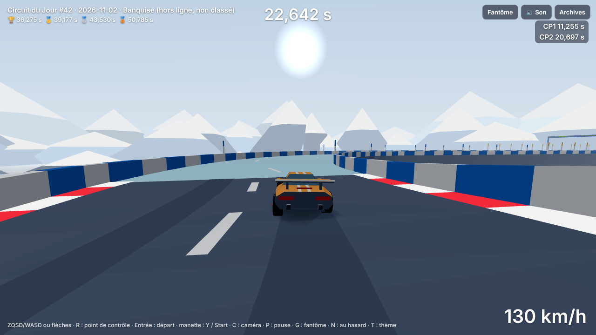
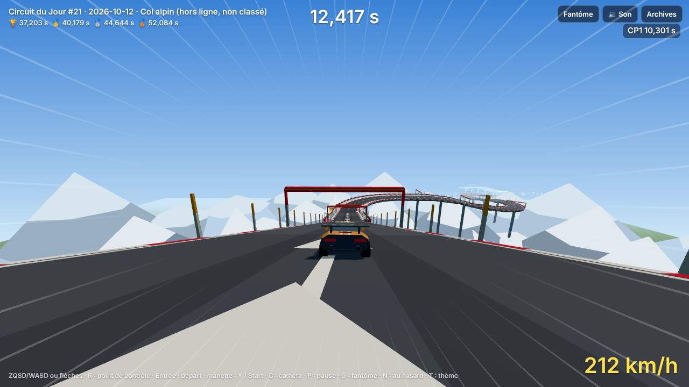
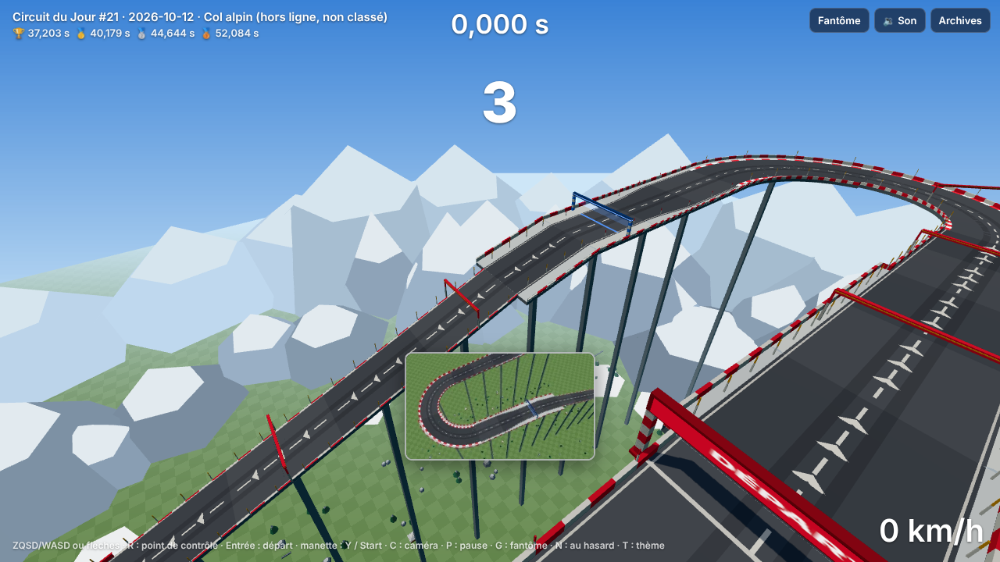

# Lot 25 — Formats de thèmes : chaque thème se joue autrement

**Essayer** (aperçu de la branche `ccr-73693dff-cm06v9`, publié par `pages.yml` ; la session impose ce nom au lieu de `lot-25-formats`) — dans cet ordre :

| | Circuit 1 | Circuit 2 | À constater |
|---|---|---|---|
| **Rallye** — la spéciale | [?seed=2026-10-13](https://nathan-te.github.io/DailyTrack/b/ccr-73693dff-cm06v9/?seed=2026-10-13) | [?seed=2026-10-18](https://nathan-te.github.io/DailyTrack/b/ccr-73693dff-cm06v9/?seed=2026-10-18) | route étroite sur la terre, **virages enchaînés, jamais plus de trois blocs droits**, bosses, aucun vide ni super turbo |
| **Canyon** — les grands espaces | [?seed=2026-10-10](https://nathan-te.github.io/DailyTrack/b/ccr-73693dff-cm06v9/?seed=2026-10-10) | [?seed=2026-10-31](https://nathan-te.github.io/DailyTrack/b/ccr-73693dff-cm06v9/?seed=2026-10-31) | route large, **longues droites et grandes courbes à fond**, deux sauts au-dessus du ravin dont un long |
| **Banquise** — la patinoire | [?seed=2026-11-02](https://nathan-te.github.io/DailyTrack/b/ccr-73693dff-cm06v9/?seed=2026-11-02) | [?seed=2026-11-05](https://nathan-te.github.io/DailyTrack/b/ccr-73693dff-cm06v9/?seed=2026-11-05) | **tout plat**, large, **la glace presque partout**, grandes courbes en roue libre |
| **Col alpin** — la descente | [?seed=2026-10-12](https://nathan-te.github.io/DailyTrack/b/ccr-73693dff-cm06v9/?seed=2026-10-12) | [?seed=2026-10-15](https://nathan-te.github.io/DailyTrack/b/ccr-73693dff-cm06v9/?seed=2026-10-15) | **vue de départ plongeante**, départ en haut, arrivée 200 m plus bas, **plus de 70 m/s dans la pente**, lacets qui descendent, sections sans rebord |

Sur n'importe quelle date : `?seed=…&theme=rallye|canyon|banquise|col` (essai, jamais classé). Une fois fusionné, les mêmes adresses marchent sur https://nathan-te.github.io/DailyTrack/.

| Rallye | Canyon |
|---|---|
|  |  |
| **Banquise** | **Col alpin** |
|  |  |

## Ce qui change pour le joueur
- **Rallye ≠ Canyon** : le Rallye est une spéciale sinueuse et lente (0,84 virage / 100 m, 38 m/s de moyenne, pointe 45 m/s), le Canyon un grand espace pris à fond (0,12 virage / 100 m, 54 m/s de moyenne, 14 % du temps en l'air).
- **Col alpin ≠ Banquise** : le Col est une vraie descente (≈ −200 m, 82 % de la longueur en descente, pointe 76 m/s **sans turbo**), la Banquise une patinoire plate (≤ 8 m d'amplitude, 45 % de glace, dix passages en roue libre par circuit).
- **Stade, Nuit, Campagne, Ville ne changent pas** : mêmes circuits, mêmes temps d'auteur (vérifié sur 24 dates par thème + 60 dates du jour).
- Au Col, une voiture tombée en haut reprend tout de suite (avant : elle tombait jusqu'au bas du circuit) ; la caméra ne passe plus sous la route dans les descentes raides.

## Livré
- **Fiche de format** (`themes.ts`, `Theme.format`, `ThemeFormat`) pour les huit thèmes : hauteurs permises, dénivelé net, amplitude, part en descente, plus haute montée, arrivée en bas, largeur dominante, virages / 100 m, plus longue suite sans virage, vitesses (moyenne visée, **pointe exigée**), sauts (nombre, vide le plus long), revêtements dominants, plaques et turbos permis, et les réglages de composition (figures exigées, nombre, budget, allure). Figures favorites et interdites : `Theme.figures`.
- **Générateur** (`generator.ts`) : la fiche se respecte à la pose (`suits` : amplitude, montée, droites, plaques et turbos ; `fits` avec les hauteurs de la fiche), puis sur le tracé (`formatViolations` : un circuit qui la contredit est refusé, graine voisine) ; la pointe exigée remplace `FAST_PEAK` (qui reste le défaut). Glace complétée jusqu'à sa part (`fillSurface`). `composeFigures(…, trace)` donne le motif de chaque refus. Les quatre thèmes inchangés ne font aucun tirage de plus.
- **Bloc** : **virage en pente** `/d` (`L2/d`, `L3/d`, `L3/bd`) : un virage large ou ample qui descend d'un niveau sur son arc (hélice, `atanRatio` déterministe dans `math.ts`) ; les lacets du Col en sont faits. Sans lui, 70 % de la longueur en descente laissait cinq virages par circuit (un virage large est 75 m de plat).
- **Chute décidée près de la voiture** (`voidYAt`, `Track.floors`) : 4 m sous la route la plus basse des cellules voisines.
- **Figures** : Rallye `speciale` (signature : virages enchaînés sur la terre, une bosse), `bosse-virage`, `petit-saut` ; Col `lacets` (refaite : tout descend), `grande-descente`, `plongeon`, `descente-epingle`, `descente-releve`, `descente-s`, `corniche` — 53 figures.
- **Empreinte** (`fingerprint.ts`) et **table de distance** dans `npm run measure:generator` (`ONLY=empreinte` pour elle seule).
- **Rendu** : vue de départ plongeante du Col (`startView.ts`), caméra au moins 1,6 m au-dessus de la route sous elle, miniature du Col cadrée sur une épingle de lacets (`THUMB_VERSION` 3) ; virages en pente dessinés (`arcPoint`). Rien d'autre.
- **Versions** : `SIM_VERSION` 15, `GENERATOR_VERSION` 16 ; golden, `history:seed` régénérés.

## Les quatre formats (mesurés, valeurs de la fiche)
| | Rallye | Canyon | Banquise | Col alpin |
|---|---|---|---|---|
| largeur dominante | 14 m (≥ 50 %) | 26 m (≥ 50 %) | 26 m (≥ 45 %) | 20 m |
| droites | ≤ 3 blocs sans virage | jusqu'à 9 blocs droits | — | — |
| virages / 100 m | 0,6–2 | ≤ 0,3, aucun serré, virages larges posés en amples | 0,4–1, aucun serré | 0,25–0,6, épingles larges en pente |
| relief | 4–12 m, bosses et petites crêtes | 12–48 m | amplitude ≤ 8 m | net ≤ −40 m, ≥ 70 % en descente, montée ≤ 4 m, arrivée en bas |
| sauts au-dessus du vide | 0 | 2 ou 3, dont un long (2 cellules) | 0 | 0 (sections sans rebord à chaque circuit) |
| turbos / plaques | 0 / ≤ 1 | permis | 0 / ≤ 2 | 0 / permises |
| revêtement | terre ≥ 30 % | sable | glace ≥ 40 % | neige en bas-côté |
| pointe exigée | — | 62,4 m/s | — | 70 m/s |

## Mesures (`npm run measure:generator`, même machine)
**Empreinte des huit thèmes** (12 circuits par thème imposé, à partir du 06/10/2026 ; avant → après pour les quatre thèmes reformés) :

| axe | Stade | Rallye | Banquise | Nuit | Campagne | Canyon | Col | Ville |
|---|---|---|---|---|---|---|---|---|
| dénivelé net (m) | −5,7 | −4 → **0** | −3 → **0** | −2 | −0,7 | −4 → −15 | −10 → **−205** | −8 |
| amplitude (m) | 17 | 17 → **7,7** | 14 → **6,7** | 14 | 13 | 18 → 24 | 17 → **205** | 15 |
| part en descente | 7 % | 8 → 4 % | 8 → 4 % | 7 % | 5 % | 9 → 12 % | 7 → **82 %** | 8 % |
| largeur moyenne (m) | 23 | 18 → **15** | 20 → **25** | 19 | 17 | 18 → **24** | 21 → 22 | 17 |
| virages / 100 m | 0,29 | 0,35 → **0,84** | 0,41 → 0,58 | 0,24 | 0,37 | 0,25 → **0,12** | 0,49 → 0,41 | 0,40 |
| plus longue droite (blocs) | 19 | 14 → **3** | 14 → 11 | 23 | 12 | 24 → **30** | 11 → 11 | 14 |
| vitesse moyenne (m/s) | 47 | 44 → **38** | 40 → 38 | 46 | 43 | 47 → **54** | 44 → 48 | 45 |
| pointe (m/s) | 88 | 78 → **45** | 82 → **57** | 84 | 84 | 86 → 83 | 80 → 76 | 84 |
| temps en l'air | 6 % | 7 → 5 % | 5 → 3 % | 7 % | 5 % | 9 → **14 %** | 6 → 11 % | 4 % |
| sauts au-dessus du vide | 1 | 1 → **0** | 0,25 → **0** | 1 | 0,58 | 1 → **2** | 0,58 → **0** | 0,17 |
| part de glace | 0 | 0 | 26 → **45 %** | 0 | 0 | 0 | 7 → 2 % | 0 |
| part de terre | 0 | 40 → **53 %** | 4 → 3 % | 0 | 20 % | 0 | 0 | 0 |
| passages en roue libre | 3,0 | 3,6 → 3,3 | 7,3 → **9,8** | 3,3 | 2,6 | 3,2 → 1,2 | 4,9 → 6,5 | 4,8 |
| freinages | 3,8 | 4,1 → 5,0 | 5,8 → 5,3 | 2,8 | 4,6 | 3,3 → 2,1 | 4,3 → 4,9 | 5,4 |
| moments de choix | 13 | 15 → 19 | 20 → 21 | 11 | 13 | 14 → **10** | 16 → **25** | 13 |

**Table de distance** (racine de la moyenne des carrés des écarts, chacun divisé par une **échelle fixe** par axe, `FINGERPRINT_AXES` : 20 m de dénivelé net, 10 m d'amplitude, 15 % de descente, 4 m de largeur, 0,15 virage / 100 m, 2 blocs de droite, 4 m/s de moyenne, 8 m/s de pointe, 3 % de temps en l'air, 1 saut, 15 % de chaque revêtement, 3 roues libres, 2 freinages ; un écart d'au moins une échelle est un écart **net**) :

| | Stade | Rallye | Banquise | Nuit | Campagne | Canyon | Col | Ville |
|---|---|---|---|---|---|---|---|---|
| Stade | — | 1,12 → 2,89 | 1,13 → 1,96 | 0,61 | 1,16 | 0,73 → 1,59 | 1,22 → 5,61 | 0,92 |
| Rallye | | — | 0,94 → 1,78 | 1,42 → 3,19 | 0,53 → 1,94 | 1,51 → 4,14 | 0,87 → 6,08 | 0,82 → 2,21 |
| Banquise | | | — | 1,49 → 2,25 | 0,76 → 1,51 | 1,60 → 3,22 | 0,64 → 5,90 | 0,60 → 1,47 |
| Nuit | | | | — | 1,53 | 0,35 → 1,27 | 1,67 → 5,80 | 1,30 |
| Campagne | | | | | — | 1,64 → 2,60 | 0,58 → 5,67 | 0,54 |
| Canyon | | | | | | — | 1,77 → 5,81 | 1,41 → 2,42 |
| Col | | | | | | | — | 0,56 → 5,56 |

- **Les deux thèmes les plus proches** : avant, **Canyon et Nuit (0,35)** ; après, **Campagne et Ville (0,54)**, inchangés par le lot (puis Nuit–Stade 0,61, inchangé). **Aucune paire ne s'est rapprochée** : les distances entre deux thèmes inchangés sont identiques (mêmes circuits), toutes les autres ont grandi.
- **Écarts nets** : Rallye / Canyon **5 sur 5** (largeur, virages / 100 m, plus longue droite, vitesse moyenne, temps en l'air) ; Col alpin / Banquise **5 sur 5** (dénivelé net, part en descente, pointe, part de glace, roue libre) ; idem sur les 6 circuits par thème de `formats.test.ts` (5 sur 5 chacun) ; l'axe le plus juste est la roue libre du Col face à la Banquise (2,8 à 3,3 passages d'écart pour une échelle de 3).
- **Chaque circuit** : Col alpin, dénivelé net ≤ −40 m sur **21 / 21** circuits (du jour et imposés ; −188 à −224 m) ; Banquise, amplitude ≤ 8 m sur **18 / 18**.

**Générateur** (60 dates à partir du 06/10/2026) : durées d'auteur 30,2–40,0 s (moyenne 36,5 s), **60 / 60 dans la fenêtre**, aucun circuit de secours, tentative retenue moyenne 1,0 (max 11) ; génération 167 ms en moyenne (max 538 ms) ; vitesse maximale du pilote 88,2 m/s au plus (Stade, super turbo ; 80 m/s au plus au Col, sous les 88 m/s des tests anti-traversée) ; aucune chute du pilote.

**Taux de validation par thème** (12 dates × 6 tentatives, thème imposé ; « dans la fenêtre » sur les circuits construits ; avant = mesure de la retouche 24 sur `main`) :

| thème | construit | pilote finit | dans la fenêtre (avant → après) | durée moyenne | vitesse max | génération / tentative |
|---|---|---|---|---|---|---|
| stade | 88 % | 98 % | 76 → 76 % | 38,2 s | 88 m/s | 170 ms |
| **rallye** | **29 %** | 100 % | 62 → **76 %** | 39,3 s | 45 m/s | 29 ms |
| **banquise** | 93 % | 99 % | 34 → **78 %** | 33,3 s | 54 m/s | 90 ms |
| nuit | 90 % | 94 % | 58 → 58 % | 39,4 s | 82 m/s | 143 ms |
| campagne | 79 % | 93 % | 68 → 68 % | 38,7 s | 85 m/s | 76 ms |
| **canyon** | 88 % | 98 % | 81 → **98 %** | 33,7 s | 84 m/s | 135 ms |
| **col** | 88 % | 100 % | 55 → **76 %** | 38,7 s | 76 m/s | 86 ms |
| ville | 78 % | 96 % | 82 → 82 % | 38,2 s | 86 m/s | 56 ms |

Le Rallye construit peu (la spéciale de quatre virages et la limite de trois blocs droits encombrent la grille : une figure ne trouve pas sa place) mais chaque tentative est bon marché (29 ms) et 76 % de ce qui est construit tombe dans la fenêtre.

**Moments de choix** (60 dates) : Rallye 19,4 · Banquise 20,7 · **Col 23,6** (le plus riche : freinages francs en bas de chaque descente, roue libre, sauts figés sur les cassures de pente) · Stade 12,3 · Nuit 10,8 · Campagne 14,1 · **Canyon 11,1** (≈ 10 sur les circuits imposés : il se prend à fond, c'est sa nature ; c'est maintenant, avec Nuit, le thème le plus pauvre) · Ville 14,3.

**Coût d'un rejeu** (course d'essai, `replayRace`, même machine, 15 mesures de 20 rejeux, `main` puis la branche, alternés ×3) : ≈ 10,4 ms sur `main` contre ≈ 10,3 ms sur la branche : **inchangé** (la chute locale lit 9 cellules par pas ; la pente d'un virage ne coûte qu'aux virages `/d`). Rejeu d'une course d'auteur : 52 ms en moyenne (max 102 ms).

## Garde-fous
- `packages/sim/test/formats.test.ts` (13 tests) : fiches cohérentes et conformes au prompt (Rallye ≤ 3 blocs droits, aucun turbo, ≤ 1 plaque, aucun saut ; Canyon sans virage serré, deux sauts dont un long ; Banquise ≤ 8 m, ≥ 40 % de glace ; Col ≤ −40 m, ≥ 70 % en descente, montée ≤ 4 m, pointe ≥ 70 m/s, aucun turbo) ; 6 circuits imposés de chacun des quatre thèmes (3 des autres) sans violation de leur fiche et dans la fenêtre ; **écarts tenus** : Rallye / Canyon ≥ 4 axes nets (et +8 m/s de moyenne, 2,5 fois plus de virages), Col / Banquise ≥ 4 axes nets (et Col sous −100 m, Banquise +30 % de glace), le Canyon le plus rapide et le plus en l'air des quatre, les quatre à plus de 1 l'un de l'autre.
- `packages/sim/test/pente.test.ts` (11 tests) : `atanRatio` à 1e-9 ; notation `/d` (refusée sur un serré, une droite, une cuve) ; hauteur d'entrée et de sortie sur toute la largeur, descente régulière le long de l'axe, gradient = dérivée de la hauteur (différences finies, relevé compris), virage sans `/d` inchangé ; **braquages au hasard** (6 graines × 20 s) dans des lacets : jamais sous la route, jamais de chute ; le pilote descend plus vite qu'à plat ; chute locale : une voiture sortie en haut reprend sans descendre à plus de 20 m (76 m avant).
- Tests adaptés (et pourquoi) : `figures.test.ts` (nombre de figures, techniques, portion rapide, relief et droites selon la fiche ; allure `pace` dans l'estimation ; favorites du Canyon que les plafonds laissent passer ; le Col n'a que des favorites), `generator.test.ts` (pointe de la fiche ; plus de saut sur la terre au Rallye mais ses virages sur la terre ; portion rapide « dans le texte » hors Rallye, Banquise et Col ; temps d'auteur = course du pilote sauf coupe sous 30 s), `sauts.test.ts` (dénivelé minimal de la fiche ; Rallye, Banquise et Col sans saut, Canyon deux dont un long), `nouveauxThemes.test.ts` (aucun virage serré au Canyon ni à la Banquise), `thumbFocus.test.ts` (signature de la spéciale), `adminPlanning.test.ts` (4 figures au Col et au Canyon).
- `apps/web/test/startView.test.ts` (vue plongeante : entière au début du décompte, nulle au départ, sans coupure ; elle regarde la descente).

## Limites et décisions pour Nathan
- **Dénivelé du Col ≈ −200 m** (demandé : au moins −40 m) : c'est la vitesse qui le veut — 70 m/s demandent cinq blocs `D3` d'affilée (une pente qui se raidit d'un coup fait décoller la voiture, et en l'air la pente ne pousse plus). La route de départ est sur des piliers de 200 m ; la vallée se voit dans la vue de départ.
- **Le Col vole beaucoup** (11 % du temps, presque autant que le Canyon) : chaque cassure de pente fait un petit saut ; le pilote fige la caisse (8 sauts figés par circuit). Lisser les cassures (raccord en courbe entre deux pentes) toucherait tous les thèmes : non fait.
- **Le Canyon devient pauvre en moments de choix** (≈ 10–11) : grandes courbes à fond, deux sauts. Leviers : un virage serré permis, plus de bas-côtés de sable dans les courbes.
- **Le Rallye ne dépasse pas 46 m/s** (aucun turbo, plaque presque jamais placée) : c'est la spéciale demandée ; à essayer pour juger si c'est trop lent.
- La part de longueur en descente compte les virages en pente : avec des lacets plats, le Col restait sous 50 % (44 à 48 % mesurés).
- Non vérifié : ressenti sur un vrai téléphone (vue plongeante, vitesse au Col), coût de rendu des piliers de 200 m (une dalle et des piliers par bloc : rien de nouveau).
