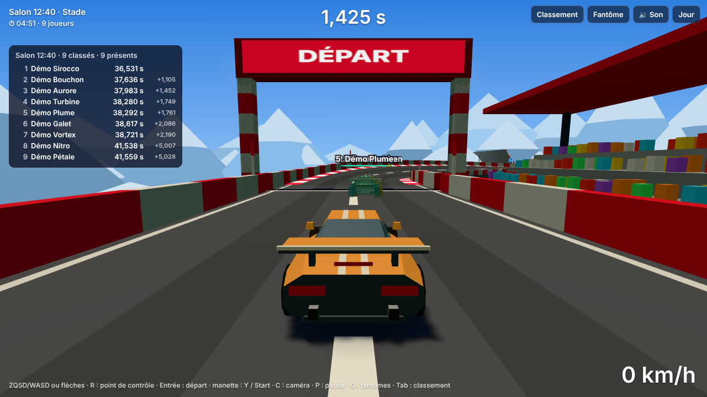
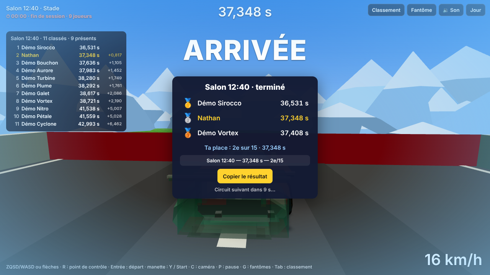

# Lot 26 — Le Salon : un circuit toutes les 10 minutes (côté jeu, avec mode démo)

**À essayer** (aperçu de la branche : `https://nathan-te.github.io/DailyTrack/b/claude-ecstatic-mccarthy-c02grk/`) :

1. **Le Salon en démonstration** : [`?mode=salon&api=demo`](https://nathan-te.github.io/DailyTrack/b/claude-ecstatic-mccarthy-c02grk/?mode=salon&api=demo) — circuit de la session en cours, joueurs fictifs qui arrivent au fil du temps (leurs fantômes avec leur pseudo, le classement à gauche, **Tab** pour l'ouvrir ou le fermer, **G** pour les fantômes), compte à rebours en haut à gauche.
2. **Voir une bascule en deux minutes** : [`?mode=salon&api=demo&salonMinutes=2`](https://nathan-te.github.io/DailyTrack/b/claude-ecstatic-mccarthy-c02grk/?mode=salon&api=demo&salonMinutes=2) — « dernier essai » à 30 s de la fin, podium, puis un autre circuit s'installe tout seul.
3. **Sur téléphone** : [`?mode=salon&api=demo&touch=1`](https://nathan-te.github.io/DailyTrack/b/claude-ecstatic-mccarthy-c02grk/?mode=salon&api=demo&touch=1) — classement avec le bouton 🏆, tout se joue au doigt.
4. Le bouton **Salon** (menu en haut à droite, dès qu'une API ou `api=demo` est configurée) mène au Salon ; **Jour** en revient.

## Ce que fait le Salon

Un circuit qui change **toutes les 10 minutes à heure fixe** (xx:00, xx:10…), le même pour tous. Le joueur arrive sur la session en cours, voit le **temps restant** (toujours), les **fantômes des meilleurs tours des autres** (les trois premiers, celui juste devant toi, celui juste derrière : au plus cinq, plus ton propre meilleur tour), le **classement de la session** (rafraîchi toutes les 5 s ; éclair quand quelqu'un te dépasse ou que tu bats ton record). À 30 s de la fin : « dernier essai ». À la fin : **podium** 10 s (trois premiers, ta place, ligne à partager `Salon 14:20 — 31,402 s — 3e/17`), puis le circuit suivant. Une course commencée avant la fin se termine, l'envoi est accepté jusqu'à 60 s après la fin ; le podium attend son résultat. **Le Salon n'écrit jamais** dans les records locaux ni dans le classement du jour, et n'a pas d'archives.

## Ce qui a été fait

- **`packages/sim`** (`salon.ts`) : `salonCircuit(session)` — même générateur, mêmes thèmes, mêmes durées (30–40 s) que le circuit du jour, **graine propre** (`SALON_SEED_BASE` + session : jamais celle d'un jour), id `salon-<session>-g<GENERATOR_VERSION>`. `salonTheme(session)` : **jamais deux fois le même thème de suite** — les sessions paires tirent leur thème, les impaires tirent parmi ceux qui diffèrent des tirages de leurs deux voisines (calcul de thèmes seulement, jamais d'un autre circuit ; vérifié sur 5 000 sessions). Le numéro de session (`floor(ms / durée)`, `salonSessionAt`) se calcule à partir d'une heure **passée en argument** : `sim` ne lit aucune horloge. `generator.ts` : la boucle de `dailyCircuit` est devenue `generateCircuit(graine, thème, variante, id)` (circuits du jour **bit à bit inchangés** : golden verts, versions inchangées). `fictional.ts` : `styleFor` / `runFictional` / `FICTIONAL_NAMES` déplacés d'`apps/api/src/history.ts` (qui les réexporte).
- **Contrat `SalonApi`** (`salonApi.ts`, implémenté ici par la démo, au lot 27 par le serveur) :

| Route | Réponse |
|---|---|
| `GET /api/salon/now?player=<id>` | `SalonNow` : heure du serveur (ms), session, début, fin, id du circuit, joueurs présents |
| `GET /api/salon/<session>/board?player=<id>&since=<v>` | `SalonBoard` : rang, **référence publique**, pseudo, temps, écart, version ; `unchanged` si la version est la même |
| `GET /api/salon/<session>/ghosts?refs=a,b` | `{ ghosts: SalonGhost[] }` : rediffusions demandées par référence |
| `POST /api/salon/<session>/submit` `{ playerId, name, replay }` | `SalonSubmitResult` : temps **recalculé**, rang, classement à jour |

  Un joueur n'est jamais désigné par son identifiant secret mais par une **référence publique** propre à la session. Le jeu a déjà `HttpSalonApi` (client fin) : sans serveur Salon (404), message clair et retour au circuit du jour.
- **Jeu** (`apps/web/src/`) : `salonMode.ts` (contrôleur : horloge, déroulé, classement, fantômes, envoi), `salon.ts` (logique pure : phases, `SalonClock` recalée sur le serveur à la moitié de l'aller-retour, choix des fantômes, ligne à partager), `salonGhosts.ts` (les fantômes : une rediffusion rejouée par la même simulation, **sans collision**), `salonUi.ts` (classement, podium), `salonDemo.ts` + `salonPlan.ts` + `salonJobs.ts` + `salonEngine.ts` + `salonWorker.ts` (démonstration), `main.ts` (changement de scène sans recharger la page, `__cdj.salon`). Fantômes : voiture allégée (une pièce), une couleur chacun, **pseudo au-dessus** (étiquette de taille constante à l'écran, masquée tout près et très loin). **Touche G** : tous / premiers seulement (trois premières places) / aucun. **Tab** : classement (bouton 🏆 sur petit écran).
- **Mode démo** (`?mode=salon&api=demo`) : `DemoSalonApi` joue le rôle du serveur dans le navigateur. 8 à 15 pilotes fictifs « Démo … » (`demoPlan`, déterministe par session) arrivent au fil de la session et envoient 1 à 3 courses de plus en plus rapides ; **leurs courses sont calculées dans un fil de travail** (pilote automatique bridé, comme l'historique du lot 11) puis **rejouées** pour obtenir le temps : le temps annoncé ne compte pas, même pour eux. Tes courses entrent dans le classement de démo après le même rejeu. Rien n'est conservé au-delà de la page. `?salonMinutes=N` (0,5 à 60) raccourcit les sessions — **démo et essais seulement** : avec une vraie API, la durée vient du serveur.
- **Bascule sans gel** : le circuit suivant est généré **dans le fil de travail pendant les deux dernières minutes**, sa scène 3D est **construite derrière le podium**, puis la bascule déplace la voiture, les fantômes et les effets dans la nouvelle scène et libère l'ancienne (géométries, matériaux, cartes d'ombres : rien ne s'accumule en une soirée).
- **Admin** : options « Le Salon » et « Durée d'une session », deux raccourcis (`adminLogic.ts`).

## Mesures

| | résultat |
|---|---|
| Génération d'un circuit de session (Node, 16 sessions de suite, conteneur) | médiane ≈ 0,5 s, au pire ≈ 1,3 s ; toujours dans le fil de travail, jamais sur le fil principal (`mainThreadGenerations` = 0 en test) |
| Une course de pilote fictif (course + rejeu de contrôle), en fil de travail | ≈ 0,15 s ; une session de démo ≈ 25 courses, calculées dans l'ordre des envois |
| **Bascule de circuit** (Chromium, rendu logiciel) | construction de la scène derrière le podium ≈ 100 ms ; **bascule elle-même ≈ 4 ms** ; aucune tâche de plus de 50 ms du fil principal dans les 3 s qui suivent |
| **Cinq fantômes + étiquettes, profil mobile 844 × 390 @2** (`MESURE=1 npx playwright test mesure-lot26`, mode alterné pendant la même course) | simulation : 0,03–0,05 ms par pas à ×1, 0,18–0,19 à ×4 (2 pas par image à 60 i/s : ≈ 0,4 ms par image à ×4) ; placement et étiquettes : 0,06 ms par image à ×1, 0,1–0,33 à ×4 ; `renderer.render` : avec / sans fantômes 1,4–2,1 / 1,8–2,2 ms à ×1 et 5,2–10,3 / 4,8–9,3 ms à ×4 : **dans le bruit** |
| Poids (compressé) | **+10 ko** dans le code du jeu (101,7 ko ; budget relevé de 96 à 104 ko) ; fil de travail du Salon 27,2 ko (une copie de `sim`), **chargé seulement dans le Salon**, budget à part |

La voiture d'un fantôme est **une seule pièce** (caisse + quatre roues fondues, sans phares) : une première version avec les roues complètes de la voiture du joueur (≈ 50 objets chacune) coûtait +6 ms par image à ×1 et +20 à +30 ms à ×4 (mesuré, comparé à la scène sans fantômes).

## Garde-fous

- `packages/sim/test/salon.test.ts` : sessions, thème jamais répété (4 époques × 1 000 sessions), les huit thèmes sortent, circuit déterministe et distinct d'un jour, durée 30–40 s sur 16 sessions, pilote fictif rejoué à l'identique.
- `apps/web/test/salon.test.ts` (30) : horloge, compte à rebours, dernier essai, clôture à +60 s, choix des fantômes (trois premiers, devant, derrière, jamais toi, au plus cinq), dépassement, touche G, ligne à partager, plan des pilotes fictifs, `DemoSalonApi` (joueurs qui arrivent, temps du rejeu, meilleur temps gardé, rediffusion falsifiée / d'un autre circuit refusée, envoi trop tardif refusé), client HTTP, voiture allégée.
- `e2e/salon.spec.ts` (11, démo, Chromium) : arrivée en cours de session (joueurs fictifs, fantômes avec leur pseudo, étiquettes dessinées), ta course classée (temps du rejeu, aucune clé `cdj:best:` écrite, « Toi » dans les fantômes), dernier essai, **podium puis bascule vers un autre circuit sans calcul sur le fil principal**, **course commencée avant la fin et finie après acceptée**, touches G et Tab, sans API (message et circuit du jour), bouton Salon / Jour, **trois téléphones** sans chevauchement (classement, podium).
- Golden inchangés ; `SIM_VERSION` et `GENERATOR_VERSION` inchangées.

## Décisions et limites

- Sessions comptées en **UTC** : `Salon 14:20` est la même heure pour tout le monde (pas l'heure locale).
- Le classement du Salon est **par session** et en mémoire en démo : recharger la page efface tes temps de démo (le vrai serveur les garde, lot 27).
- Un tour n'est envoyé que s'il **améliore** ton meilleur de la session.
- Ce lot a été fait **avant la fusion du lot 25** ([#41](https://github.com/Nathan-Te/DailyTrack/pull/41), à la demande de Nathan) : il utilise le générateur tel qu'il est. À la fusion du lot 25 les circuits de session suivront ses fiches de format et sa `GENERATOR_VERSION` ; `history:seed` et l'identifiant `salon-<session>-g<G>` s'adaptent d'eux-mêmes ; rien d'autre à refaire.
- Non vérifié : rendu et fluidité sur un **vrai téléphone**, Firefox et WebKit (la CI), un Salon avec un vrai serveur (lot 27).
